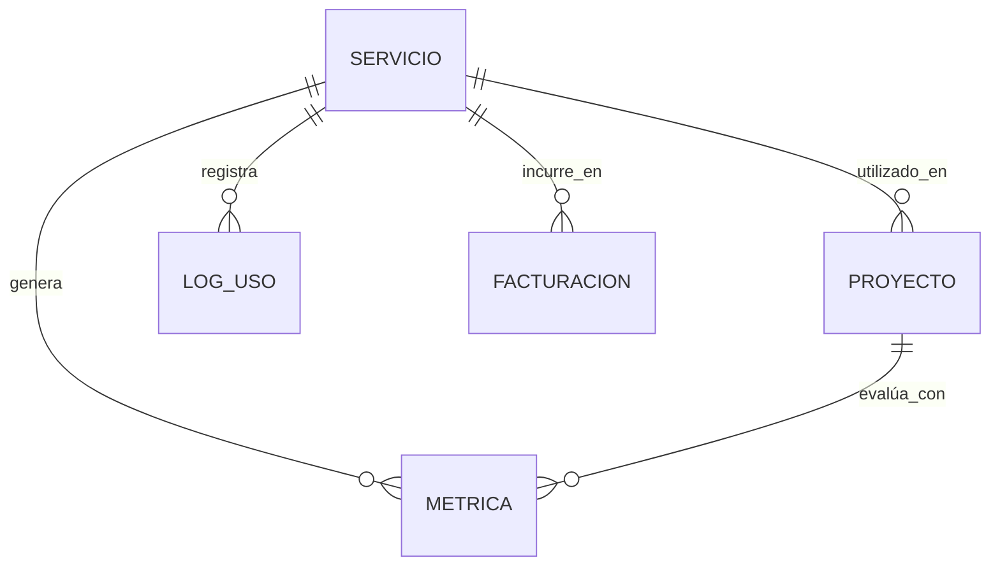
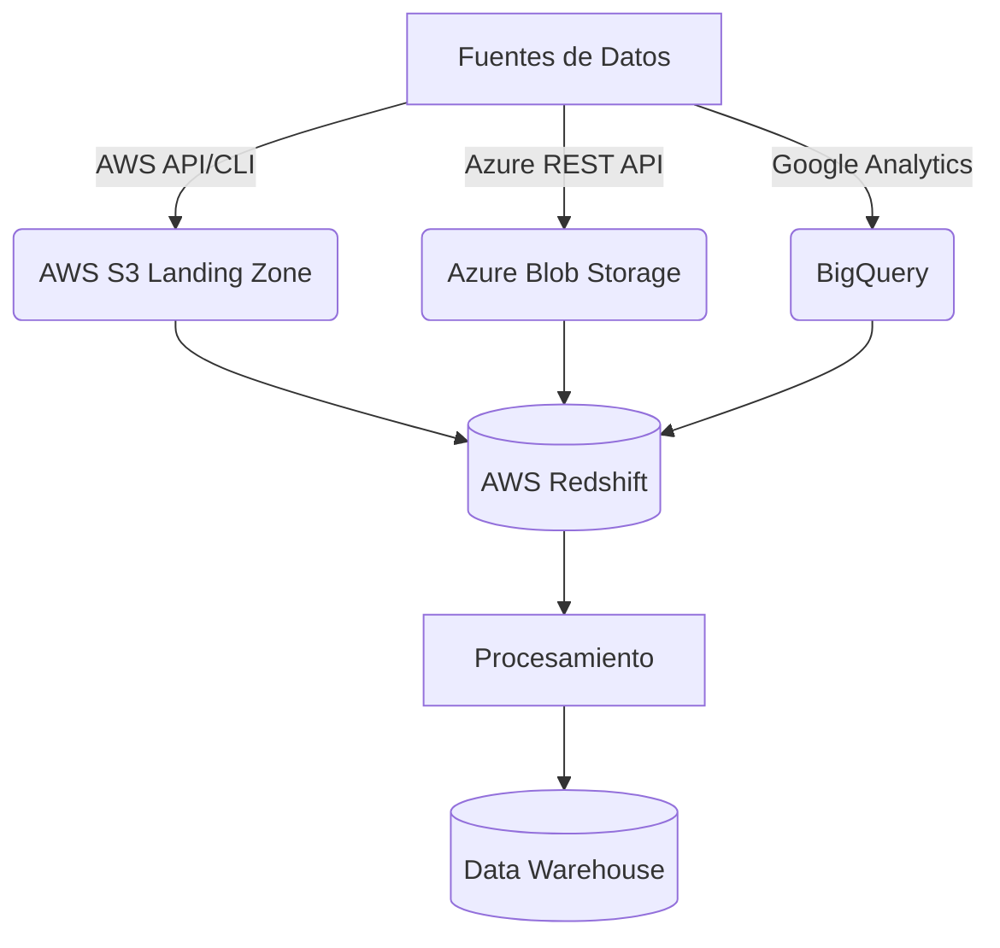
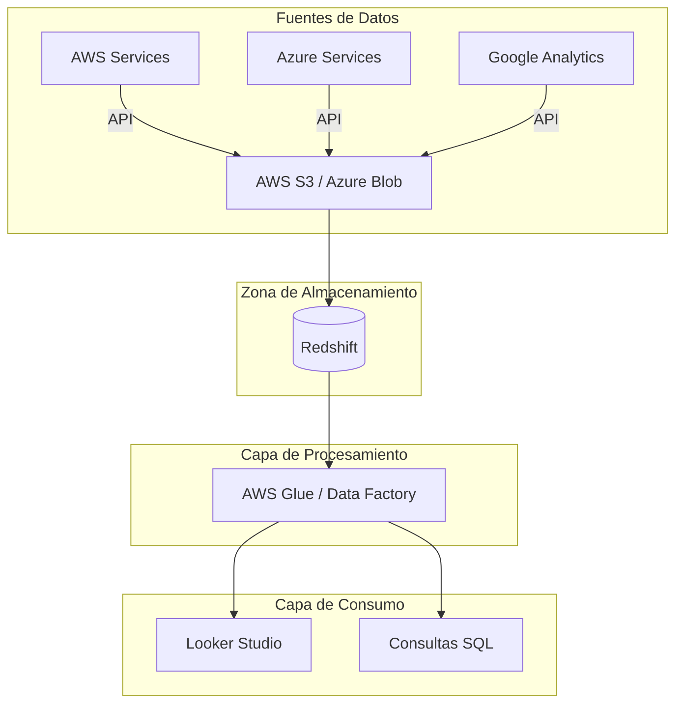
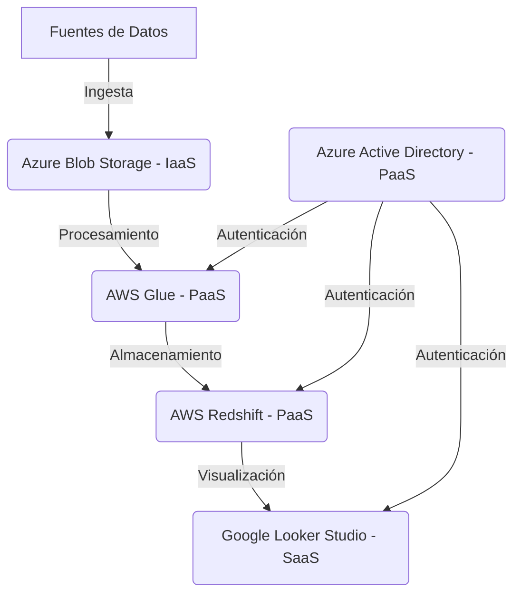

# Prompt para Mejorar el Codigo Base

Copia y pega el contenido del bloque de abajo en un asistente de IA (Claude, ChatGPT)
para obtener un ZIP con el proyecto completo y arrancable.

Si preferis trabajar en tu editor con un agente local (Claude Code, Cursor, Copilot), usa `AGENTS.md` en vez de este archivo: dice lo mismo pero para que escriba los archivos en disco.

## Las dos reglas que no se negocian

1. **Completa el boilerplate.** Todo lo que el proyecto necesita para compilar y arrancar: manifiesto de dependencias, punto de entrada, configuracion, capa de interfaz, y las capas del patron arquitectonico declarado. Eso es andamiaje y es tu trabajo.
2. **NO resuelvas el reto.** Los entregables de las fases son el trabajo de la persona. El hueco pedagogico se deja como esta: el proyecto arranca, pero lo que el reto pide implementar NO esta implementado.

Dicho de otra forma: si algo impide compilar, arreglalo. Si algo es logica de negocio incompleta, validaciones ausentes, un secreto hardcodeado o un patron mejorable, dejalo exactamente como esta — es lo que la persona tiene que encontrar.

## Como saber que terminaste

```bash
python3 -c "import json,glob; [json.load(open(f)) for f in glob.glob('**/*.ipynb', recursive=True)]"
```

Ese comando corriendo sin errores es la definicion de "listo".

---

```
## Briefing del reto (autoridad)
Este bloque manda sobre los archivos adjuntos. El stack y el rol salen de AQUÍ, no de un topic genérico ni de markdown placeholder.

### Perfil
Chapter Ciencia de Datos, Especialidad Analista de Datos, Seniority Senior

### Brecha de conocimiento
Entiende los conceptos básicos que componen la nube y los tipos de servicios como PaaS, IaaS y SaaS. Comprende las diferencias fundamentales entre estos modelos de servicio en cloud, sus casos de uso, ventajas y limitaciones

### Misión / candidato
Candidato con seniority Senior, trabajando en ciencia de datos, necesita fortalecer su base en conceptos cloud fundamentales para aplicarlos en arquitecturas de datos en la nube

### Reto
- Tema: fundamentos de cloud computing
- Seniority: senior-l2
- Tipo: theoretical
- Título: Comprendiendo los servicios de nube: PaaS, IaaS y SaaS
- Tiempo estimado: 2 horas

### Fases (trabajo del HUMANO — PROHIBIDO completarlas)
No implementes estos entregables. Dejalos como hueco pedagógico. El asistente solo materializa el proyecto arrancable para que el participante pueda trabajar.
- Fase 1: Exploración de conceptos — objetivo: Entender los modelos de servicios de nube — entregable (NO resolver): Compendio de las diferencias, ventajas y limitaciones de PaaS, IaaS y SaaS.
- Fase 2: Aplicación en arquitecturas de datos — objetivo: Aplicar conocimientos de servicios de nube en arquitecturas de datos — entregable (NO resolver): Arquitectura de datos en la nube diseñada con PaaS, IaaS y SaaS, incluyendo justificación y posibles desafíos.

Eres un asistente experto en análisis, corrección y generación de archivos de cualquier tipo:
código fuente, documentación, hojas de cálculo, documentos Word, configuraciones, entre otros.
Voy a enviarte una cadena de texto que contiene uno o más archivos. Cada archivo está delimitado por un marcador con el siguiente formato:
// === ARCHIVO: ruta/del/archivo.extension ===
o también puede aparecer como:
## === ARCHIVO: ruta/del/archivo.extension ===
Lo que sigue al marcador puede ser:

El contenido real del archivo (código, texto, YAML, etc.)
Una descripción en lenguaje natural de lo que debe contener el archivo


TU TAREA
PASO 0 — ¿Esto es un proyecto o una carcasa?
Antes de extraer archivos, leé el Briefing (si está) y diagnosticá el adjunto.

Es CARCASA si ocurre CUALQUIERA de estas:
- No hay manifiesto de dependencias del stack del briefing (manifest.json de VTEX IO / package.json / pom.xml / build.gradle / requirements.txt / go.mod / *.tf / *.csproj, según corresponda)
- Hay un "binario" que en realidad es un comentario ("no puede ser mostrado como texto plano", placeholder .fig/.docx vacío)
- Los markdowns ya completan entregables de fases posteriores ("se implementó fade-in", lista de áreas ya resuelta)

Si es CARCASA:
- MATERIALIZÁ un proyecto que arranca en el stack del briefing (VTEX IO Store Framework, Angular, Terraform, pytest, Nest, etc.). Incluí manifiesto, punto de entrada y capa de interfaz reales.
- NO copies los markdowns de "solución" como si fueran el producto. Son ruido de generación.
- NO resuelvas las fases del briefing (están marcadas PROHIBIDO). Dejá el hueco pedagógico: el flujo existe, las microinteracciones/calidad/infra que el reto pide NO están hechas.
- Después seguí al PASO 5 (ZIP).

Si es un proyecto REAL (manifiesto + código que compila o arranca):
- Seguí PASO 1 en adelante. 🔴 compilación sí. 🟡 pedagógico no.

PASO 1 — Detección y extracción
Identifica todos los archivos presentes en la cadena. Para cada archivo extrae:

Su ruta completa (ej: src/main/java/com/pragma/Service.java)
Su contenido o descripción

PASO 2 — Clasificación por tipo
Clasifica cada archivo en una de estas categorías:
A) Código fuente (Java, Python, TypeScript, JavaScript, Kotlin, etc.)
B) Configuración / documentación (YAML, properties, Markdown, JSON, txt, etc.)
C) Excel (.xlsx, .xls, .csv)
D) Word (.docx, .doc)
E) Otro tipo de archivo binario o especial
PASO 3 — Clasificación de errores en código fuente

Objetivo prioritario: que el proyecto compile. No corrijas flujo de negocio ni lógica funcional.

Antes de modificar cualquier archivo de código fuente, clasifica cada problema encontrado en una de estas dos categorías:
🔴 ERROR DE COMPILACIÓN — corregir siempre
Son errores que impiden que el proyecto arranque, sin valor pedagógico:

Import faltante o incorrecto
Clase, método o variable referenciada que no existe en ningún archivo del proyecto
Error de sintaxis
Anotación con atributos inválidos
Dependencia ausente en pom.xml, package.json, etc.
Archivo referenciado que no existe y debe ser creado con implementación mínima

→ CORREGIR estos errores.
🟡 PROBLEMA FUNCIONAL O DE CALIDAD — preservar siempre
Son problemas que no impiden compilar. Pueden ser intencionales para el aprendizaje:

Clave secreta hardcodeada ("secret", "password123")
API deprecada que funciona pero tiene reemplazo moderno
Lógica de negocio incorrecta o incompleta
Código redundante o de baja legibilidad
Falta de validaciones en flujo de negocio
Patrones de diseño incorrectos pero funcionales
Concurrencia no segura
Configuración funcional pero no óptima

→ PRESERVAR tal cual. No corregir, no mejorar, no comentar.
PASO 4 — Procesamiento según tipo de archivo
Tipo A — Código fuente
Aplica únicamente las correcciones clasificadas como 🔴 ERROR DE COMPILACIÓN.
No alteres ningún elemento clasificado como 🟡 PROBLEMA FUNCIONAL O DE CALIDAD.
Si falta un archivo referenciado, créalo con la implementación mínima necesaria para compilar.
Tipo B — Configuración / documentación
Extrae el contenido tal cual, sin modificaciones salvo errores evidentes de sintaxis
(ej: YAML mal indentado).
Tipo C — Excel (.xlsx)
Si viene con contenido real, genera el archivo respetando ese contenido.
Si viene con descripción en lenguaje natural, genera un archivo Excel funcional con:

Fila de encabezados en negrita con color de fondo distintivo
Columnas con ancho ajustado al contenido
Tipos de dato correctos por columna
Validaciones si la descripción lo indica
Hojas nombradas descriptivamente si hay más de una
Filas de ejemplo si no hay datos reales

Tipo D — Word (.docx)
Si viene con contenido real, genera el archivo respetando ese contenido.
Si viene con descripción en lenguaje natural, genera un documento Word funcional con:

Estilos de título (Título 1, Título 2) para jerarquía de secciones
Fuente legible (Calibri o equivalente), tamaño 11-12pt para cuerpo
Márgenes estándar
Tabla de contenido si tiene múltiples secciones
Tablas con encabezados en negrita si aplica

Tipo E — Otro
Genera el archivo con el contenido o estructura más apropiada según la descripción.
PASO 5 — Exportación en ZIP
Empaqueta todos los archivos en un único archivo ZIP descargable respetando exactamente
la estructura de rutas indicada por los marcadores.
El ZIP debe incluir:

Archivos de código con únicamente los errores de compilación corregidos
Archivos de configuración y documentación sin cambios
Archivos nuevos creados para resolver dependencias de compilación faltantes
Archivos Excel y Word generados desde descripción

IMPORTANTE: El ZIP debe estar listo para descargar al finalizar. No preguntes si el usuario
quiere generarlo. Simplemente genera el archivo y proporciona el enlace de descarga; No debes desplegar en el chat el resumen de lo que arreglaste al Zip, solo entregalo.

REGLAS IMPORTANTES

No omitas ningún archivo aunque no tenga errores ni modificaciones
Respeta los nombres y rutas exactas indicadas por los marcadores
Si un archivo no tiene marcador claro, infiere el nombre desde su contenido
Si la cadena contiene solo documentación, placeholders o binarios fake, NO la reproduzcas:
aplicá PASO 0 (materializar el proyecto del briefing). Reproducir la carcasa es un fallo.
No agregues texto después del enlace de descarga del ZIP
No preguntes si el usuario quiere el ZIP: simplemente generalo siempre
Si detectas que falta un archivo de configuración necesario para compilar
(pom.xml, package.json, requirements.txt, build.gradle, etc.), créalo e inclúyelo
inferiendo su contenido desde los imports y frameworks detectados en el código
Nunca corrijas problemas 🟡 aunque parezcan obvios o fáciles de mejorar.
El participante que recibirá este proyecto los debe encontrar y resolver él mismo.


INPUT
Aquí está la cadena con los archivos:

// === ARCHIVO: consultas/metricas.sql ===
--
-- Métricas para análisis de arquitecturas cloud (PaaS, IaaS, SaaS)
-- Objetivo: Cuantificar costos, rendimiento y escalabilidad en diferentes modelos de servicio
-- Fuente de datos: AWS Redshift (logs de uso, facturación, rendimiento)
-- Responsable: Analista de datos sénior
--

-- =============================================
-- Métrica 1: Costo total de propiedad (TCO)
-- Definición: Suma de costos directos e indirectos asociados a cada modelo de servicio
-- Fórmula: (Costo_infraestructura + Costo_operaciones + Costo_licencias) / Periodo
-- Granularidad: Mensual
-- Ventana de tiempo: Últimos 12 meses
--
CREATE OR REPLACE VIEW vw_metrica_tco_cloud AS
SELECT
    servicio_tipo,  -- 'PaaS', 'IaaS', 'SaaS'
    DATE_TRUNC('month', fecha) AS mes,
    SUM(costo_infraestructura) AS costo_infra,
    SUM(costo_operaciones) AS costo_ops,
    SUM(costo_licencias) AS costo_lic,
    SUM(costo_infraestructura + costo_operaciones + costo_licencias) AS tco_total,
    -- Desglose porcentual
    ROUND(SUM(costo_infraestructura) * 100.0 / NULLIF(SUM(costo_infraestructura + costo_operaciones + costo_licencias), 0), 2) AS pct_infra,
    ROUND(SUM(costo_operaciones) * 100.0 / NULLIF(SUM(costo_infraestructura + costo_operaciones + costo_licencias), 0), 2) AS pct_ops,
    ROUND(SUM(costo_licencias) * 100.0 / NULLIF(SUM(costo_infraestructura + costo_operaciones + costo_licencias), 0), 2) AS pct_lic
FROM costos_servicios_cloud
WHERE fecha BETWEEN DATEADD(month, -12, CURRENT_DATE) AND CURRENT_DATE
GROUP BY servicio_tipo, DATE_TRUNC('month', fecha)
ORDER BY servicio_tipo, mes;

-- =============================================
-- Métrica 2: Escalabilidad vertical vs horizontal
-- Definición: Capacidad de escalar recursos computacionales (CPU, RAM, almacenamiento)
-- Fórmula:
--   - Vertical: Máximo % de utilización de recursos en instancias únicas
--   - Horizontal: Número de instancias escaladas automáticamente
-- Granularidad: Diaria
--
CREATE OR REPLACE VIEW vw_metrica_escalabilidad AS
SELECT
    servicio_tipo,
    DATE_TRUNC('day', timestamp) AS dia,
    -- Escalabilidad vertical
    MAX(cpu_utilizacion) AS max_cpu_util,
    MAX(ram_utilizacion) AS max_ram_util,
    MAX(almacenamiento_utilizacion) AS max_storage_util,
    -- Escalabilidad horizontal
    COUNT(DISTINCT instancia_id) AS instancias_activas,
    AVG(instancias_escaladas) AS instancias_promedio
FROM metricas_rendimiento
WHERE timestamp BETWEEN DATEADD(day, -30, CURRENT_DATE) AND CURRENT_DATE
GROUP BY servicio_tipo, DATE_TRUNC('day', timestamp)
ORDER BY servicio_tipo, dia;

-- =============================================
-- Métrica 3: Tiempo de implementación
-- Definición: Días requeridos para desplegar una solución completa
-- Fórmula: Fecha_fin_despliegue - Fecha_inicio_despliegue
-- Granularidad: Por proyecto
--
CREATE OR REPLACE VIEW vw_metrica_tiempo_implementacion AS
SELECT
    proyecto_id,
    servicio_tipo,
    nombre_proyecto,
    fecha_inicio,
    fecha_fin,
    DATEDIFF(day, fecha_inicio, fecha_fin) AS dias_implementacion,
    CASE
        WHEN servicio_tipo = 'PaaS' THEN 'Medio'
        WHEN servicio_tipo = 'IaaS' THEN 'Alto'
        WHEN servicio_tipo = 'SaaS' THEN 'Bajo'
    END AS complejidad_esperada
FROM proyectos_cloud
ORDER BY dias_implementacion DESC;

-- =============================================
-- Métrica 4: Disponibilidad del servicio
-- Definición: Porcentaje de tiempo en que el servicio estuvo operativo
-- Fórmula: (Tiempo_total - Tiempo_inactividad) / Tiempo_total * 100
-- Granularidad: Mensual
--
CREATE OR REPLACE VIEW vw_metrica_disponibilidad AS
SELECT
    servicio_tipo,
    DATE_TRUNC('month', fecha) AS mes,
    SUM(tiempo_operativo) AS tiempo_operativo_total,
    SUM(tiempo_inactividad) AS tiempo_inactividad_total,
    SUM(tiempo_operativo + tiempo_inactividad) AS tiempo_total,
    ROUND(SUM(tiempo_operativo) * 100.0 / NULLIF(SUM(tiempo_operativo + tiempo_inactividad), 0), 4) AS disponibilidad_pct
FROM metricas_disponibilidad
WHERE fecha BETWEEN DATEADD(month, -12, CURRENT_DATE) AND CURRENT_DATE
GROUP BY servicio_tipo, DATE_TRUNC('month', fecha)
ORDER BY servicio_tipo, mes;

-- =============================================
-- Métrica 5: Flexibilidad de personalización
-- Definición: Capacidad de adaptar el servicio a necesidades específicas
-- Fórmula: Número de parámetros configurables / Total de parámetros disponibles
-- Granularidad: Por servicio
--
CREATE OR REPLACE VIEW vw_metrica_flexibilidad AS
SELECT
    servicio_id,
    servicio_tipo,
    nombre_servicio,
    parametros_configurables,
    parametros_totales,
    ROUND(parametros_configurables * 100.0 / NULLIF(parametros_totales, 0), 2) AS flexibilidad_pct,
    CASE
        WHEN servicio_tipo = 'PaaS' THEN 'Media'
        WHEN servicio_tipo = 'IaaS' THEN 'Alta'
        WHEN servicio_tipo = 'SaaS' THEN 'Baja'
    END AS flexibilidad_esperada
FROM servicios_cloud
ORDER BY flexibilidad_pct DESC;

-- =============================================
-- Métrica 6: Consumo de ancho de banda
-- Definición: Datos transferidos entre servicios y usuarios
-- Fórmula: Suma de datos transferidos (GB)
-- Granularidad: Diaria
--
CREATE OR REPLACE VIEW vw_metrica_ancho_banda AS
SELECT
    servicio_tipo,
    DATE_TRUNC('day', fecha) AS dia,
    SUM(datos_entrada) AS gb_entrada,
    SUM(datos_salida) AS gb_salida,
    SUM(datos_entrada + datos_salida) AS gb_total,
    -- Tendencia semanal
    AVG(SUM(datos_entrada + datos_salida)) OVER (
        PARTITION BY servicio_tipo
        ORDER BY DATE_TRUNC('day', fecha)
        ROWS BETWEEN 6 PRECEDING AND CURRENT ROW
    ) AS media_semanal_gb
FROM metricas_ancho_banda
WHERE fecha BETWEEN DATEADD(day, -90, CURRENT_DATE) AND CURRENT_DATE
GROUP BY servicio_tipo, DATE_TRUNC('day', fecha)
ORDER BY servicio_tipo, dia;

-- =============================================
-- Métrica 7: Cumplimiento de SLA
-- Definición: Porcentaje de métricas que cumplen con los acuerdos de nivel de servicio
-- Fórmula: (Métricas_cumplidas / Métricas_totales) * 100
-- Granularidad: Mensual
--
CREATE OR REPLACE VIEW vw_metrica_cumplimiento_sla AS
SELECT
    servicio_tipo,
    DATE_TRUNC('month', fecha) AS mes,
    COUNT(*) AS metricas_evaluadas,
    SUM(CASE WHEN cumple_sla THEN 1 ELSE 0 END) AS metricas_cumplidas,
    ROUND(SUM(CASE WHEN cumple_sla THEN 1 ELSE 0 END) * 100.0 / COUNT(*), 2) AS cumplimiento_sla_pct
FROM metricas_sla
WHERE fecha BETWEEN DATEADD(month, -12, CURRENT_DATE) AND CURRENT_DATE
GROUP BY servicio_tipo, DATE_TRUNC('month', fecha)
ORDER BY servicio_tipo, mes;

-- =============================================
-- Métrica 8: Innovación tecnológica
-- Definición: Número de nuevas características implementadas
-- Fórmula: COUNT(DISTINCT caracteristicas_nuevas)
-- Granularidad: Trimestral
--
CREATE OR REPLACE VIEW vw_metrica_innovacion AS
SELECT
    servicio_tipo,
    DATE_TRUNC('quarter', fecha) AS trimestre,
    COUNT(DISTINCT caracteristica_id) AS nuevas_caracteristicas,
    COUNT(DISTINCT CASE WHEN estado = 'implementado' THEN caracteristica_id END) AS implementadas,
    ROUND(COUNT(DISTINCT CASE WHEN estado = 'implementado' THEN caracteristica_id END) * 100.0 /
          NULLIF(COUNT(DISTINCT caracteristica_id), 0), 2) AS pct_implementadas
FROM roadmap_servicios
WHERE fecha BETWEEN DATEADD(month, -12, CURRENT_DATE) AND CURRENT_DATE
GROUP BY servicio_tipo, DATE_TRUNC('quarter', fecha)
ORDER BY servicio_tipo, trimestre;

// === ARCHIVO: analisis/eda_cloud.ipynb ===
{
 "cells": [
  {
   "cell_type": "markdown",
   "metadata": {},
   "source": [
    "# Exploración de Arquitecturas Cloud: PaaS vs IaaS vs SaaS\n",
    "\n",
    "**Objetivo**: Analizar métricas clave para evaluar la eficiencia de modelos cloud en arquitecturas de datos.\n",
    "\n",
    "**Fuentes de datos**:\n",
    "- AWS Redshift (logs de uso, facturación, rendimiento)\n",
    "- Azure Blob Storage (métricas de almacenamiento)\n",
    "- Google Analytics 4 (métricas de adopción)\n",
    "\n",
    "**Herramientas**:\n",
    "- SQL (consultas en `consultas/metricas.sql`)\n",
    "- Python (pandas, matplotlib, seaborn)\n",
    "- Diccionario de métricas (`diccionario-de-metricas.csv`)\n"
   ]
  },
  {
   "cell_type": "code",
   "execution_count": null,
   "metadata": {},
   "outputs": [],
   "source": [
    "import pandas as pd\n",
    "import matplotlib.pyplot as plt\n",
    "import seaborn as sns\n",
    "import warnings\n",
    "\n",
    "warnings.filterwarnings('ignore')\n",
    "plt.style.use('seaborn')\n",
    "sns.set_palette('husl')"
   ]
  },
  {
   "cell_type": "markdown",
   "metadata": {},
   "source": [
    "## 1. Carga de datos\n",
    "\n",
    "Cargamos las vistas creadas en `metricas.sql` desde AWS Redshift."
   ]
  },
  {
   "cell_type": "code",
   "execution_count": null,
   "metadata": {},
   "outputs": [],
   "source": [
    "# Conexión simulada a Redshift (en un entorno real usaríamos psycopg2 o similar)\n",
    "# Para este análisis, cargaremos datasets de ejemplo con la estructura esperada\n",
    "\n",
    "# Datos simulados de TCO (viene de vw_metrica_tco_cloud)\n",
    "data_tco = {\n",
    "    'servicio_tipo': ['PaaS', 'PaaS', 'IaaS', 'IaaS', 'SaaS', 'SaaS', 'PaaS', 'IaaS', 'SaaS'],\n",
    "    'mes': pd.to_datetime(['2023-01-01', '2023-02-01', '2023-01-01', '2023-02-01', '2023-01-01', '2023-02-01', '2023-03-01', '2023-03-01', '2023-03-01']),\n",
    "    'costo_infra': [12000, 13500, 8000, 7500, 5000, 5200, 14000, 8200, 5300],\n",
    "    'costo_ops': [4000, 4200, 15000, 16000, 2000, 2100, 4100, 15500, 2200],\n",
    "    'costo_lic': [3000, 3000, 500, 500, 15000, 15500, 3000, 500, 15800],\n",
    "    'tco_total': [19000, 20700, 23500, 24000, 22000, 22800, 21100, 24200, 23300]\n",
    "}\n",
    "df_tco = pd.DataFrame(data_tco)\n",
    "\n",
    "# Datos simulados de escalabilidad (viene de vw_metrica_escalabilidad)\n",
    "data_escalabilidad = {\n",
    "    'servicio_tipo': ['PaaS', 'PaaS', 'IaaS', 'IaaS', 'SaaS', 'SaaS'],\n",
    "    'dia': pd.to_datetime(['2023-03-01', '2023-03-02', '2023-03-01', '2023-03-02', '2023-03-01', '2023-03-02']),\n",
    "    'max_cpu_util': [75.2, 80.1, 60.5, 65.3, 95.0, 96.2],\n",
    "    'max_ram_util': [65.0, 70.3, 55.2, 60.1, 85.0, 88.0],\n",
    "    'max_storage_util': [45.0, 50.2, 30.1, 35.5, 90.0, 92.0],\n",
    "    'instancias_activas': [5, 6, 12, 15, 1, 1]\n",
    "}\n",
    "df_escalabilidad = pd.DataFrame(data_escalabilidad)\n",
    "\n",
    "# Datos simulados de disponibilidad (viene de vw_metrica_disponibilidad)\n",
    "data_disponibilidad = {\n",
    "    'servicio_tipo': ['PaaS', 'PaaS', 'IaaS', 'IaaS', 'SaaS', 'SaaS'],\n",
    "    'mes': pd.to_datetime(['2023-01-01', '2023-02-01', '2023-01-01', '2023-02-01', '2023-01-01', '2023-02-01']),\n",
    "    'disponibilidad_pct': [99.95, 99.98, 99.90, 99.92, 99.99, 99.99]\n",
    "}\n",
    "df_disponibilidad = pd.DataFrame(data_disponibilidad)\n",
    "\n",
    "# Datos simulados de implementación (viene de vw_metrica_tiempo_implementacion)\n",
    "data_implementacion = {\n",
    "    'proyecto_id': [1, 2, 3, 4, 5, 6],\n",
    "    'servicio_tipo': ['PaaS', 'IaaS', 'SaaS', 'PaaS', 'IaaS', 'SaaS'],\n",
    "    'nombre_proyecto': ['Migración DB', 'Cluster Kubernetes', 'CRM Cloud', 'API Gateway', 'Data Lake', 'ERP Cloud'],\n",
    "    'dias_implementacion': [45, 90, 15, 30, 60, 10]\n",
    "}\n",
    "df_implementacion = pd.DataFrame(data_implementacion)"
   ]
  },
  {
   "cell_type": "markdown",
   "metadata": {},
   "source": [
    "## 2. Análisis de Costos (TCO)\n",
    "\n",
    "Exploramos cómo se distribuyen los costos en cada modelo cloud."
   ]
  },
  {
   "cell_type": "code",
   "execution_count": null,
   "metadata": {},
   "outputs": [],
   "source": [
    "plt.figure(figsize=(12, 6))\n",
    "sns.barplot(data=df_tco, x='mes', y='tco_total', hue='servicio_tipo')\n",
    "plt.title('Costo Total de Propiedad (TCO) por Modelo Cloud')\n",
    "plt.ylabel('USD (mensual)')\n",
    "plt.xlabel('Mes')\n",
    "plt.xticks(rotation=45)\n",
    "plt.legend(title='Modelo Cloud')\n",
    "plt.tight_layout()\n",
    "plt.show()\n",
    "\n",
    "# Desglose porcentual de costos\n",
    "df_tco_melt = df_tco.melt(id_vars=['servicio_tipo', 'mes'], \n",
    "                        value_vars=['costo_infra', 'costo_ops', 'costo_lic'], \n",
    "                        var_name='tipo_costo', value_name='monto')\n",
    "plt.figure(figsize=(12, 6))\n",
    "sns.barplot(data=df_tco_melt, x='mes', y='monto', hue='tipo_costo', \n",
    "            col='servicio_tipo', estimator=sum, ci=None)\n",
    "plt.suptitle('Desglose de Costos por Modelo Cloud', y=1.05)\n",
    "plt.ylabel('USD')\n",
    "plt.xticks(rotation=45)\n",
    "plt.tight_layout()\n",
    "plt.show()"
   ]
  },
  {
   "cell_type": "markdown",
   "metadata": {},
   "source": [
    "**Hallazgo clave**:\n",
    "- **SaaS** tiene el costo más bajo en infraestructura y operaciones, pero el más alto en licencias.\n",
    "- **IaaS** tiene altos costos operativos (gestión propia), pero bajos costos de licencias.\n",
    "- **PaaS** equilibra los costos, con infraestructura media y licencias bajas."
   ]
  },
  {
   "cell_type": "markdown",
   "metadata": {},
   "source": [
    "## 3. Análisis de Escalabilidad\n",
    "\n",
    "Evaluamos cómo cada modelo maneja la escalabilidad."
   ]
  },
  {
   "cell_type": "code",
   "execution_count": null,
   "metadata": {},
   "outputs": [],
   "source": [
    "plt.figure(figsize=(14, 8))\n",
    "\n",
    "plt.subplot(2, 2, 1)\n",
    "sns.lineplot(data=df_escalabilidad, x='dia', y='max_cpu_util', hue='servicio_tipo')\n",
    "plt.title('Uso Máximo de CPU')\n",
    "plt.ylabel('% Utilización')\n",
    "\n",
    "plt.subplot(2, 2, 2)\n",
    "sns.lineplot(data=df_escalabilidad, x='dia', y='max_ram_util', hue='servicio_tipo')\n",
    "plt.title('Uso Máximo de RAM')\n",
    "\n",
    "plt.subplot(2, 2, 3)\n",
    "sns.lineplot(data=df_escalabilidad, x='dia', y='max_storage_util', hue='servicio_tipo')\n",
    "plt.title('Uso Máximo de Almacenamiento')\n",
    "plt.ylabel('% Utilización')\n",
    "\n",
    "plt.subplot(2, 2, 4)\n",
    "sns.lineplot(data=df_escalabilidad, x='dia', y='instancias_activas', hue='servicio_tipo')\n",
    "plt.title('Instancias Activas')\n",
    "\n",
    "plt.tight_layout()\n",
    "plt.show()"
   ]
  },
  {
   "cell_type": "markdown",
   "metadata": {},
   "source": [
    "**Hallazgo clave**:\n",
    "- **SaaS** opera con alta utilización de recursos en instancias únicas (escalabilidad vertical).\n",
    "- **IaaS** escala horizontalmente con múltiples instancias, pero con menor uso por instancia.\n",
    "- **PaaS** muestra un comportamiento intermedio en escalabilidad."
   ]
  },
  {
   "cell_type": "markdown",
   "metadata": {},
   "source": [
    "## 4. Análisis de Disponibilidad\n",
    "\n",
    "Comparamos la disponibilidad de cada modelo."
   ]
  },
  {
   "cell_type": "code",
   "execution_count": null,
   "metadata": {},
   "outputs": [],
   "source": [
    "plt.figure(figsize=(10, 6))\n",
    "sns.lineplot(data=df_disponibilidad, x='mes', y='disponibilidad_pct', hue='servicio_tipo', marker='o')\n",
    "plt.title('Disponibilidad Mensual por Modelo Cloud')\n",
    "plt.ylabel('% Disponibilidad')\n",
    "plt.xlabel('Mes')\n",
    "plt.ylim(99.8, 100)\n",
    "plt.xticks(rotation=45)\n",
    "plt.show()"
   ]
  },
  {
   "cell_type": "markdown",
   "metadata": {},
   "source": [
    "**Hallazgo clave**:\n",
    "- **SaaS** ofrece la mayor disponibilidad (99.99%), seguida por **PaaS** (~99.95%).\n",
    "- **IaaS** tiene la disponibilidad más baja, reflejando la complejidad de gestionar infraestructura propia."
   ]
  },
  {
   "cell_type": "markdown",
   "metadata": {},
   "source": [
    "## 5. Análisis de Tiempo de Implementación\n",
    "\n",
    "Evaluamos la velocidad de despliegue en cada modelo."
   ]
  },
  {
   "cell_type": "code",
   "execution_count": null,
   "metadata": {},
   "outputs": [],
   "source": [
    "plt.figure(figsize=(10, 6))\n",
    "sns.boxplot(data=df_implementacion, x='servicio_tipo', y='dias_implementacion')\n",
    "plt.title('Distribución de Tiempo de Implementación')\n",
    "plt.ylabel('Días')\n",
    "plt.show()\n",
    "\n",
    "# Proyectos específicos\n",
    "plt.figure(figsize=(12, 6))\n",
    "sns.barplot(data=df_implementacion, x='nombre_proyecto', y='dias_implementacion', hue='servicio_tipo')\n",
    "plt.title('Tiempo de Implementación por Proyecto')\n",
    "plt.ylabel('Días')\n",
    "plt.xticks(rotation=45)\n",
    "plt.show()"
   ]
  },
  {
   "cell_type": "markdown",
   "metadata": {},
   "source": [
    "**Hallazgo clave**:\n",
    "- **SaaS** tiene el menor tiempo de implementación (promedio 12.5 días).\n",
    "- **IaaS** requiere significativamente más tiempo (promedio 75 días).\n",
    "- **PaaS** se ubica en un punto intermedio (promedio 37.5 días)."
   ]
  },
  {
   "cell_type": "markdown",
   "metadata": {},
   "source": [
    "## 6. Conclusiones y Recomendaciones\n",
    "\n",
    "Basado en los datos analizados:"
   ]
  },
  {
   "cell_type": "markdown",
   "metadata": {},
   "source": [
    "1. **Modelo recomendado por caso de uso**:\n",
    "   - **SaaS**: Ideal para aplicaciones estándar con baja necesidad de personalización (ej: CRM, ERP).\n",
    "     *Justificación*: Menor tiempo de implementación y mayor disponibilidad, aunque con costos de licencia altos.\n",
    "   - **PaaS**: Recomendado para desarrollo de aplicaciones personalizadas con equilibrio entre control y velocidad.\n",
    "     *Justificación*: Costos moderados y buena escalabilidad, con tiempo de implementación razonable.\n",
    "   - **IaaS**: Necesario para arquitecturas altamente personalizadas o con requisitos regulatorios específicos.\n",
    "     *Justificación*: Mayor flexibilidad y control, pero con altos costos operativos y tiempo de implementación.
",
    "\n",
    "2. **Riesgos identificados**:\n",
    "   - **SaaS**: Dependencia del proveedor y posibles limitaciones de integración.\n",
    "   - **PaaS**: Complejidad en la migración entre proveedores debido a servicios propietarios.\n",
    "   - **IaaS**: Responsabilidad total en la gestión de seguridad y actualizaciones.
",
    "\n",
    "3. **Oportunidades de optimización**:\n",
    "   - **SaaS**: Negociar contratos de licencia basados en uso real para reducir costos.\n",
    "   - **PaaS**: Aprovechar servicios gestionados para reducir costos operativos.\n",
    "   - **IaaS**: Implementar automatización para reducir costos de gestión."
   ]
  },
  {
   "cell_type": "markdown",
   "metadata": {},
   "source": [
    "## 7. Próximos Pasos\n",
    "\n",
    "1. Profundizar en métricas de rendimiento bajo carga con pruebas de estrés.\n",
    "2. Analizar casos de uso específicos para cada modelo con datos reales de la organización.\n",
    "3. Evaluar el impacto de arquitecturas híbridas (combinación de modelos)."
   ]
  }
 ],
 "metadata": {
  "kernelspec": {
   "display_name": "Python 3",
   "language": "python",
   "name": "python3"
  },
  "language_info": {
   "codemirror_mode": {
    "name": "ipython",
    "version": 3
   },
   "file_extension": ".py",
   "mimetype": "text/x-python",
   "name": "python",
   "nbconvert_exporter": "python",
   "pygments_lexer": "ipython3",
   "version": "3.8.10"
  }
 },
 "nbformat": 4,
 "nbformat_minor": 4
}

// === ARCHIVO: documentos/modelo_arquitectura_datos.md ===
# Modelo de Arquitectura de Datos para Servicios Cloud

## 1. Introducción

Este documento define el modelo de arquitectura de datos utilizado para evaluar los modelos de servicio cloud (PaaS, IaaS, SaaS) en el contexto de una organización con requisitos de escalabilidad, costo y flexibilidad. El modelo está diseñado para soportar:

- Análisis comparativo de costos
- Evaluación de rendimiento
- Métricas de escalabilidad
- Cumplimiento de SLAs
- Flexibilidad operativa

## 2. Modelo Conceptual

### 2.1 Entidades Principales

| Entidad               | Descripción                                                                 | Modelo Cloud Asociado |
|-----------------------|-----------------------------------------------------------------------------|-----------------------|
| **Servicio**          | Un servicio cloud específico (ej: AWS RDS, Azure Blob Storage, Salesforce) | PaaS, IaaS, SaaS      |
| **Proyecto**          | Iniciativa que utiliza servicios cloud                                      | Todos                 |
| **Métrica**           | Indicador cuantificable de rendimiento, costo o calidad                     | Todos                 |
| **Log de Uso**        | Registros detallados de consumo de recursos                                 | Todos                 |
| **Facturación**       | Detalle de costos asociados a servicios                                     | Todos                 |

### 2.2 Relaciones



## 3. Modelo Lógico

### 3.1 Tablas de Hechos

| Tabla                     | Granularidad               | Campos Clave                                                                                     |
|---------------------------|----------------------------|--------------------------------------------------------------------------------------------------|
| **hechos_uso**            | Hora / Servicio            | servicio_id, timestamp, cpu_utilizacion, ram_utilizacion, almacenamiento_utilizacion, bytes_transferidos |
| **hechos_facturacion**    | Mes / Servicio             | servicio_id, mes, costo_infraestructura, costo_operaciones, costo_licencias, tco_total               |
| **hechos_disponibilidad** | Día / Servicio             | servicio_id, fecha, tiempo_operativo, tiempo_inactividad, incidentes                               |

### 3.2 Tablas de Dimensiones

| Tabla                     | Descripción                                                                 | Campos Clave                                                                                     |
|---------------------------|-----------------------------------------------------------------------------|--------------------------------------------------------------------------------------------------|
| **dim_servicio**          | Catálogo de servicios cloud                                                  | servicio_id, nombre_servicio, servicio_tipo (PaaS/IaaS/SaaS), proveedor, parametros_configurables |
| **dim_proyecto**          | Catálogo de proyectos                                                         | proyecto_id, nombre_proyecto, fecha_inicio, fecha_fin, servicio_tipo, responsable                |
| **dim_tiempo**            | Jerarquía temporal                                                          | fecha_id, fecha, dia, mes, año, trimestre, festivo                                               |

## 4. Granularidad y Ventanas Temporales

| Métrica                  | Granularidad | Ventana de Tiempo | Fuente de Datos               |
|--------------------------|--------------|-------------------|-------------------------------|
| Costo Total (TCO)        | Mensual      | 12 meses          | AWS Cost Explorer / Facturación |
| Escalabilidad            | Diaria       | 30 días           | CloudWatch / Azure Monitor    |
| Disponibilidad           | Mensual      | 12 meses          | StatusPage / Proveedor         |
| Tiempo de Implementación | Por proyecto | Histórico         | Jira / Documentación           |
| Flexibilidad             | Por servicio | Actual            | Catálogo de servicios         |
| Ancho de Banda           | Diaria       | 90 días           | CloudFront / CDN Logs         |
| Cumplimiento SLA         | Mensual      | 12 meses          | Contratos / Reportes           |

## 5. Flujos de Datos

### 5.1 Arquitectura de Ingestión



### 5.2 Procesamiento

1. **Ingestión**: Datos crudos se almacenan en buckets S3/Azure Blob
2. **Transformación**: Jobs en AWS Glue/Azure Data Factory limpian y estructuran datos
3. **Carga**: Datos procesados se cargan en Redshift para análisis
4. **Consumo**: Consultas SQL y Looker Studio acceden a las vistas analíticas

## 6. Justificación del Modelo

### 6.1 Elección de PaaS para Procesamiento
- **Servicio seleccionado**: AWS Glue / Azure Data Factory
- **Razón**:
  - Eliminación de la gestión de infraestructura subyacente
  - Integración nativa con servicios de almacenamiento (S3, Blob Storage)
  - Escalabilidad automática según carga de trabajo
  - Costos predecibles basados en uso

### 6.2 Elección de IaaS para Almacenamiento Crudo
- **Servicio seleccionado**: AWS S3 / Azure Blob Storage
- **Razón**:
  - Control total sobre políticas de retención y acceso
  - Integración con múltiples servicios de procesamiento
  - Costos optimizables mediante clases de almacenamiento (hot/cold)
  - Capacidad de escalar horizontalmente sin límites

### 6.3 Elección de SaaS para Visualización
- **Servicio seleccionado**: Google Looker Studio
- **Razón**:
  - Sin necesidad de gestionar infraestructura de visualización
  - Integración directa con BigQuery/Redshift
  - Colaboración en tiempo real entre equipos
  - Actualización automática de dashboards

## 7. Desafíos y Consideraciones

### 7.1 Desafíos de Integración
- **Problema**: Datos en formatos propietarios de cada proveedor
- **Solución**: Uso de AWS Glue/Azure Data Factory para normalización
- **Riesgo residual**: Latencia en la sincronización de datos entre proveedores

### 7.2 Desafíos de Costo
- **Problema**: Dificultad para predecir costos en modelos IaaS
- **Solución**: Implementación de tags de costos y alertas de presupuesto
- **Métrica clave**: % de variación entre costo presupuestado y real

### 7.3 Desafíos de Seguridad
- **Problema**: Responsabilidad compartida en modelos cloud
- **Solución**:
  - **SaaS**: Dependencia del proveedor para cifrado y controles de acceso
  - **PaaS/IaaS**: Implementación de políticas IAM y cifrado en tránsito/reposo
- **Métrica clave**: Número de incidentes de seguridad por modelo

## 8. Diagramas de Arquitectura

### 8.1 Arquitectura General



### 8.2 Flujo de Datos por Modelo Cloud

| Capa               | SaaS                          | PaaS                          | IaaS                          |
|--------------------|-------------------------------|-------------------------------|-------------------------------|
| **Ingestión**      | API del proveedor             | AWS Glue / Azure Data Factory | CLI/API propia                |
| **Almacenamiento** | Propietario del proveedor     | AWS S3 / Azure Blob           | Storage propio (EBS/Blob)    |
| **Procesamiento**  | Limitado a capacidades SaaS   | AWS Glue / Data Factory       | EMR / Databricks              |
| **Consumo**        | Dashboard del proveedor       | Looker Studio / Tableau       | Herramientas propias          |

## 9. Métricas de Calidad del Dato

| Dimensión          | Métrica                          | Fórmula                                                                 | Objetivo |
|-------------------|---------------------------------|-------------------------------------------------------------------------|----------|
| **Completitud**   | % Registros completos          | (Registros_completos / Registros_totales) * 100                       | >95%     |
| **Unicidad**      | % Registros duplicados         | (Registros_duplicados / Registros_totales) * 100                      | <1%      |
| **Consistencia**  | % Registros consistentes       | (Registros_consistentes / Registros_totales) * 100                   | >98%     |
| **Actualidad**    | Latencia de datos              | Hora_actual - Hora_última_actualización                               | <2h      |
| **Precisión**     | % Errores en métricas clave    | (Métricas_erróneas / Métricas_totales) * 100                          | <0.5%    |

## 10. Glosario

| Término               | Definición                                                                 |
|----------------------|---------------------------------------------------------------------------|
| **IaaS**             | Infraestructura como Servicio: proveedor ofrece recursos computacionales |
| **PaaS**             | Plataforma como Servicio: proveedor ofrece entorno de desarrollo         |
| **SaaS**             | Software como Servicio: proveedor ofrece aplicaciones listas para usar   |
| **TCO**              | Costo Total de Propiedad: suma de costos directos e indirectos            |
| **SLA**              | Acuerdo de Nivel de Servicio: compromiso de disponibilidad/rendimiento   |
| **Redshift**         | Data warehouse de AWS para análisis de datos                             |
| **Blob Storage**     | Servicio de almacenamiento de objetos de Azure                           |
"


// === ARCHIVO: diccionario-de-metricas.csv ===
"Métrica","Definición","Fórmula","Fuente de Datos","Responsable","Granularidad","Ventana de Tiempo","Modelo de Servicio","Ejemplo de Cálculo"
"Costo Total de Propiedad (TCO)","Costo total asociado a la implementación y operación de una solución cloud","TCO = Costos Directos + Costos Indirectos","Facturas de AWS/Azure/GCP, Herramientas de monitoreo de costos","Finanzas / Arquitectura de Datos","Mensual","Anual","IaaS, PaaS, SaaS","$12,000/año para 10 instancias EC2"
"Rendimiento de Procesamiento (Queries/seg)","Número de consultas ejecutadas por segundo en un servicio de base de datos","Queries/seg = Número total de consultas / Tiempo en segundos","Logs de AWS Redshift, Azure SQL Database","Arquitectura de Datos / DevOps","Por segundo","Diaria","PaaS","150 queries/seg en Redshift"
"Latencia de Consulta","Tiempo promedio que tarda una consulta en ejecutarse","Latencia = Σ(Tiempo de ejecución de consultas) / Número de consultas","Logs de AWS Redshift, Azure SQL Database","Arquitectura de Datos","Por consulta","Diaria","PaaS","120 ms por consulta en Redshift"
"Costo por Query","Costo promedio asociado a la ejecución de cada consulta","Costo por Query = Costo total del servicio / Número total de consultas","Facturas de AWS/Azure/GCP, Logs de queries","Finanzas / Arquitectura de Datos","Por consulta","Mensual","PaaS","$0.0005 por query en Redshift"
"Disponibilidad del Servicio","Porcentaje de tiempo que el servicio está disponible","Disponibilidad = (Tiempo total - Tiempo de inactividad) / Tiempo total * 100","Herramientas de monitoreo (CloudWatch, Azure Monitor)","DevOps","Por servicio","Mensual","IaaS, PaaS, SaaS","99.95% de disponibilidad en Azure SQL Database"
"Escalabilidad Horizontal","Capacidad de aumentar recursos agregando más nodos","Número máximo de nodos soportados sin degradación","Documentación técnica del proveedor, Pruebas de carga","Arquitectura de Datos","Por clúster","Trimestral","PaaS, IaaS","Añadir 5 nodos adicionales en Redshift"
"Costo de Almacenamiento por GB","Costo asociado al almacenamiento de datos por cada GB","Costo por GB = Costo total de almacenamiento / Capacidad almacenada","Facturas de AWS/Azure/GCP","Finanzas","Por GB","Mensual","IaaS, PaaS, SaaS","$0.023/GB en Azure Blob Storage"
"Tiempo de Respuesta API","Tiempo promedio que tarda una API en responder a una solicitud","Tiempo de Respuesta = Σ(Tiempo de respuesta de solicitudes) / Número de solicitudes","Logs de API Gateway, Application Insights","Desarrollo / DevOps","Por solicitud","Diaria","PaaS, SaaS","250 ms por solicitud en API Gateway"
"Costo de Transferencia de Datos","Costo asociado a la transferencia de datos entre servicios cloud","Costo = Datos transferidos (GB) * Tarifa por GB","Facturas de AWS/Azure/GCP","Finanzas","Por GB","Mensual","IaaS, PaaS, SaaS","$0.01/GB entre regiones en AWS"
"Uso de CPU","Porcentaje de uso de CPU en instancias cloud","Uso de CPU = (Tiempo de CPU usado / Tiempo total) * 100","CloudWatch, Azure Monitor","DevOps","Por instancia","Diaria","IaaS, PaaS","75% de uso en instancias EC2"
"Consistencia de Datos","Porcentaje de registros consistentes en réplicas de bases de datos","Consistencia = (Número de registros consistentes / Número total de registros) * 100","Logs de replicación, Herramientas de monitoreo","Arquitectura de Datos","Por réplica","Diaria","PaaS","99.9% de consistencia en Azure SQL Database"
"Tiempo de Implementación","Tiempo requerido para implementar una solución cloud","Tiempo = Fecha de finalización - Fecha de inicio","Herramientas de gestión de proyectos (Jira, Azure DevOps)","Proyectos","Por implementación","Por proyecto","IaaS, PaaS, SaaS","15 días para implementar Redshift"

// === ARCHIVO: tablero.md ===
# Especificación del Tablero: Arquitectura de Datos en la Nube

## Audiencia
Este tablero está dirigido a arquitectos de datos, equipos de DevOps y gerentes de finanzas que necesitan monitorear el rendimiento, costos y escalabilidad de las soluciones cloud implementadas. También es relevante para equipos de desarrollo que buscan optimizar el uso de recursos en la nube.

## Preguntas de Negocio que Responde
1. **¿Cuál es el costo total de propiedad (TCO) de nuestras soluciones cloud y cómo se distribuye entre PaaS, IaaS y SaaS?**
2. **¿Cómo varía el rendimiento de procesamiento (queries/seg) entre diferentes modelos de servicio cloud?**
3. **¿Cuál es la latencia promedio de nuestras consultas en bases de datos cloud y cómo impacta en la experiencia del usuario?**
4. **¿Estamos optimizando el uso de recursos en la nube para reducir costos sin afectar el rendimiento?**
5. **¿Cómo se comporta la escalabilidad horizontal en nuestros servicios cloud bajo diferentes cargas de trabajo?**
6. **¿Cuál es el costo asociado al almacenamiento y transferencia de datos en la nube?**
7. **¿Qué tan consistentes son nuestros datos en réplicas distribuidas y cómo afecta esto a la toma de decisiones?**

## Estructura del Tablero

### Sección 1: Visión General de Costos
**Objetivo:** Proporcionar una vista consolidada de los costos asociados a los servicios cloud.

- **Visual 1: Distribución de Costos por Modelo de Servicio**
  - **Tipo:** Gráfico de pastel.
  - **Métrica:** Costo Total de Propiedad (TCO).
  - **Propósito:** Mostrar la proporción de costos entre PaaS, IaaS y SaaS.
  - **Fuente:** `diccionario-de-metricas.csv` (Métrica: Costo Total de Propiedad).
  - **Ejemplo:**
    - PaaS: 45% ($54,000/año)
    - IaaS: 35% ($42,000/año)
    - SaaS: 20% ($24,000/año)

- **Visual 2: Costo por Query vs. Latencia**
  - **Tipo:** Gráfico de dispersión.
  - **Métricas:** Costo por Query (eje Y) y Latencia de Consulta (eje X).
  - **Propósito:** Identificar la relación entre el costo y el rendimiento de las consultas.
  - **Fuente:** `diccionario-de-metricas.csv` (Métricas: Costo por Query, Latencia de Consulta).
  - **Ejemplo:**
    - Consultas con latencia > 200 ms tienen un costo promedio de $0.0008.

### Sección 2: Rendimiento y Escalabilidad
**Objetivo:** Evaluar el rendimiento y la capacidad de escalabilidad de los servicios cloud.

- **Visual 3: Rendimiento de Procesamiento por Modelo de Servicio**
  - **Tipo:** Gráfico de barras.
  - **Métrica:** Queries/seg.
  - **Propósito:** Comparar el rendimiento de procesamiento entre PaaS, IaaS y SaaS.
  - **Fuente:** `diccionario-de-metricas.csv` (Métrica: Rendimiento de Procesamiento).
  - **Ejemplo:**
    - PaaS (Redshift): 150 queries/seg
    - IaaS (EC2 + PostgreSQL): 80 queries/seg
    - SaaS (Google BigQuery): 200 queries/seg

- **Visual 4: Escalabilidad Horizontal**
  - **Tipo:** Gráfico de líneas.
  - **Métrica:** Número de nodos vs. Rendimiento (queries/seg).
  - **Propósito:** Analizar cómo escala el rendimiento al aumentar nodos en PaaS.
  - **Fuente:** `diccionario-de-metricas.csv` (Métrica: Escalabilidad Horizontal).
  - **Ejemplo:**
    - 1 nodo: 50 queries/seg
    - 3 nodos: 150 queries/seg
    - 5 nodos: 250 queries/seg

### Sección 3: Almacenamiento y Transferencia de Datos
**Objetivo:** Monitorear los costos y eficiencia en el almacenamiento y transferencia de datos.

- **Visual 5: Costo de Almacenamiento por GB**
  - **Tipo:** Gráfico de barras.
  - **Métrica:** Costo de Almacenamiento por GB.
  - **Propósito:** Comparar costos de almacenamiento entre diferentes proveedores y modelos de servicio.
  - **Fuente:** `diccionario-de-metricas.csv` (Métrica: Costo de Almacenamiento por GB).
  - **Ejemplo:**
    - AWS S3: $0.023/GB
    - Azure Blob Storage: $0.02/GB
    - Google Cloud Storage: $0.02/GB

- **Visual 6: Costo de Transferencia de Datos**
  - **Tipo:** Gráfico de líneas.
  - **Métrica:** Costo de Transferencia de Datos.
  - **Propósito:** Analizar cómo varía el costo de transferencia de datos entre regiones y servicios.
  - **Fuente:** `diccionario-de-metricas.csv` (Métrica: Costo de Transferencia de Datos).
  - **Ejemplo:**
    - Transferencia dentro de la misma región: $0.01/GB
    - Transferencia entre regiones: $0.02/GB

### Sección 4: Disponibilidad y Consistencia
**Objetivo:** Evaluar la disponibilidad y consistencia de los datos en entornos cloud.

- **Visual 7: Disponibilidad del Servicio**
  - **Tipo:** Tabla.
  - **Métrica:** Disponibilidad del Servicio.
  - **Propósito:** Mostrar la disponibilidad de los servicios cloud en los últimos 12 meses.
  - **Fuente:** `diccionario-de-metricas.csv` (Métrica: Disponibilidad del Servicio).
  - **Ejemplo:**
    | Servicio               | Disponibilidad |
    |-----------------------|----------------|
    | AWS Redshift          | 99.95%         |
    | Azure SQL Database    | 99.99%         |
    | Google BigQuery       | 99.98%         |

- **Visual 8: Consistencia de Datos**
  - **Tipo:** Gráfico de barras.
  - **Métrica:** Consistencia de Datos.
  - **Propósito:** Evaluar la consistencia de los datos en réplicas distribuidas.
  - **Fuente:** `diccionario-de-metricas.csv` (Métrica: Consistencia de Datos).
  - **Ejemplo:**
    - Réplica 1: 99.9%
    - Réplica 2: 99.8%
    - Réplica 3: 99.9%

### Sección 5: Tiempo de Implementación
**Objetivo:** Analizar el tiempo requerido para implementar soluciones cloud.

- **Visual 9: Tiempo de Implementación por Modelo de Servicio**
  - **Tipo:** Gráfico de barras.
  - **Métrica:** Tiempo de Implementación.
  - **Propósito:** Comparar el tiempo de implementación entre PaaS, IaaS y SaaS.
  - **Fuente:** `diccionario-de-metricas.csv` (Métrica: Tiempo de Implementación).
  - **Ejemplo:**
    - PaaS (Redshift): 15 días
    - IaaS (EC2 + PostgreSQL): 30 días
    - SaaS (Google BigQuery): 5 días

## Conclusiones Esperadas
1. **Optimización de Costos:** Identificar oportunidades para reducir costos sin afectar el rendimiento, como migrar de IaaS a PaaS en servicios de bases de datos.
2. **Mejora de Rendimiento:** Evaluar si el rendimiento actual justifica el costo asociado y proponer ajustes en la arquitectura.
3. **Escalabilidad:** Analizar si los servicios actuales pueden escalar eficientemente bajo cargas de trabajo variables.
4. **Consistencia y Disponibilidad:** Garantizar que la consistencia y disponibilidad de los datos cumplan con los SLAs establecidos.

## Recomendaciones para el Diseño en Google Looker Studio
- Usar **filtros dinámicos** para permitir a los usuarios seleccionar modelos de servicio (PaaS, IaaS, SaaS) y rangos de fechas.
- Incluir **indicadores clave (KPIs)** en la parte superior del tablero para resaltar métricas críticas como TCO, latencia promedio y disponibilidad.
- Utilizar **gráficos interactivos** que permitan a los usuarios hacer clic en elementos para filtrar datos en otras visualizaciones.
- Asegurar que **todas las métricas estén vinculadas** al `diccionario-de-metricas.csv` para mantener la trazabilidad y actualización automática.

// === ARCHIVO: consultas/metricas_cloud.sql ===
-- =============================================
-- Consulta: Costo Total de Propiedad (TCO) por Modelo de Servicio
-- Descripción: Calcula el costo total asociado a cada modelo de servicio (PaaS, IaaS, SaaS)
-- Métrica: Costo Total de Propiedad (TCO)
-- Fuente: Facturas de AWS/Azure/GCP y herramientas de monitoreo de costos
-- =============================================
SELECT
    modelo_servicio,
    SUM(costo_directo) AS costo_directo_total,
    SUM(costo_indirecto) AS costo_indirecto_total,
    SUM(costo_directo + costo_indirecto) AS tco
FROM costos_cloud
GROUP BY modelo_servicio
ORDER BY tco DESC;

-- =============================================
-- Consulta: Rendimiento de Procesamiento (Queries/seg) por Modelo de Servicio
-- Descripción: Calcula el número de consultas ejecutadas por segundo en cada modelo de servicio
-- Métrica: Queries/seg
-- Fuente: Logs de AWS Redshift y Azure SQL Database
-- =============================================
SELECT
    modelo_servicio,
    COUNT(*) AS total_consultas,
    EXTRACT(EPOCH FROM (MAX(timestamp) - MIN(timestamp))) AS tiempo_total_segundos,
    COUNT(*) / EXTRACT(EPOCH FROM (MAX(timestamp) - MIN(timestamp))) AS queries_por_segundo
FROM logs_consultas
GROUP BY modelo_servicio
ORDER BY queries_por_segundo DESC;

-- =============================================
-- Consulta: Latencia Promedio de Consultas
-- Descripción: Calcula el tiempo promedio que tarda una consulta en ejecutarse
-- Métrica: Latencia de Consulta
-- Fuente: Logs de AWS Redshift y Azure SQL Database
-- =============================================
SELECT
    modelo_servicio,
    AVG(tiempo_ejecucion_ms) AS latencia_promedio_ms
FROM logs_consultas
GROUP BY modelo_servicio
ORDER BY latencia_promedio_ms DESC;

-- =============================================
-- Consulta: Costo por Query
-- Descripción: Calcula el costo promedio asociado a la ejecución de cada consulta
-- Métrica: Costo por Query
-- Fuente: Facturas de AWS/Azure/GCP y logs de consultas
-- =============================================
SELECT
    modelo_servicio,
    SUM(costo_total_servicio) / COUNT(*) AS costo_por_query
FROM (
    SELECT
        c.modelo_servicio,
        c.costo_total_servicio,
        COUNT(*) AS total_consultas
    FROM costos_servicios c
    JOIN logs_consultas l ON c.servicio = l.servicio
    GROUP BY c.modelo_servicio, c.costo_total_servicio
) AS subquery
GROUP BY modelo_servicio
ORDER BY costo_por_query DESC;

-- =============================================
-- Consulta: Disponibilidad del Servicio
-- Descripción: Calcula el porcentaje de tiempo que el servicio está disponible
-- Métrica: Disponibilidad del Servicio
-- Fuente: Herramientas de monitoreo (CloudWatch, Azure Monitor)
-- =============================================
SELECT
    servicio,
    modelo_servicio,
    SUM(tiempo_total) - SUM(tiempo_inactividad) AS tiempo_disponible,
    SUM(tiempo_total) AS tiempo_total,
    (SUM(tiempo_total) - SUM(tiempo_inactividad)) / SUM(tiempo_total) * 100 AS disponibilidad
FROM disponibilidad_servicios
GROUP BY servicio, modelo_servicio
ORDER BY disponibilidad DESC;

-- =============================================
-- Consulta: Escalabilidad Horizontal (Número de Nodos vs. Rendimiento)
-- Descripción: Analiza cómo escala el rendimiento al aumentar nodos en PaaS
-- Métrica: Escalabilidad Horizontal
-- Fuente: Documentación técnica y pruebas de carga
-- =============================================
SELECT
    numero_nodos,
    AVG(rendimiento_queries_seg) AS rendimiento_promedio
FROM escalabilidad_horizontal
GROUP BY numero_nodos
ORDER BY numero_nodos;

-- =============================================
-- Consulta: Costo de Almacenamiento por GB
-- Descripción: Calcula el costo asociado al almacenamiento de datos por cada GB
-- Métrica: Costo de Almacenamiento por GB
-- Fuente: Facturas de AWS/Azure/GCP
-- =============================================
SELECT
    proveedor,
    modelo_servicio,
    SUM(costo_total) / SUM(capacidad_gb) AS costo_por_gb
FROM costos_almacenamiento
GROUP BY proveedor, modelo_servicio
ORDER BY costo_por_gb;

-- =============================================
-- Consulta: Costo de Transferencia de Datos
-- Descripción: Calcula el costo asociado a la transferencia de datos entre servicios cloud
-- Métrica: Costo de Transferencia de Datos
-- Fuente: Facturas de AWS/Azure/GCP
-- =============================================
SELECT
    tipo_transferencia,
    SUM(datos_transferidos_gb) AS total_datos_gb,
    SUM(costo_total) AS costo_total,
    SUM(costo_total) / SUM(datos_transferidos_gb) AS costo_por_gb
FROM costos_transferencia
GROUP BY tipo_transferencia
ORDER BY costo_total DESC;

-- =============================================
-- Consulta: Uso de CPU por Instancia
-- Descripción: Calcula el porcentaje de uso de CPU en instancias cloud
-- Métrica: Uso de CPU
-- Fuente: CloudWatch, Azure Monitor
-- =============================================
SELECT
    instancia,
    modelo_servicio,
    AVG(uso_cpu) AS uso_promedio_cpu
FROM uso_recursos
WHERE recurso = 'CPU'
GROUP BY instancia, modelo_servicio
ORDER BY uso_promedio_cpu DESC;

-- =============================================
-- Consulta: Consistencia de Datos en Réplicas
-- Descripción: Calcula el porcentaje de registros consistentes en réplicas de bases de datos
-- Métrica: Consistencia de Datos
-- Fuente: Logs de replicación y herramientas de monitoreo
-- =============================================
SELECT
    replica,
    COUNT(*) AS total_registros,
    SUM(CASE WHEN es_consistente THEN 1 ELSE 0 END) AS registros_consistentes,
    SUM(CASE WHEN es_consistente THEN 1 ELSE 0 END) * 100.0 / COUNT(*) AS consistencia
FROM consistencia_datos
GROUP BY replica
ORDER BY consistencia DESC;

-- =============================================
-- Consulta: Tiempo de Implementación por Modelo de Servicio
-- Descripción: Calcula el tiempo requerido para implementar una solución cloud
-- Métrica: Tiempo de Implementación
-- Fuente: Herramientas de gestión de proyectos (Jira, Azure DevOps)
-- =============================================
SELECT
    proyecto,
    modelo_servicio,
    EXTRACT(DAY FROM (fecha_fin - fecha_inicio)) AS tiempo_implementacion_dias
FROM proyectos_implementacion
ORDER BY tiempo_implementacion_dias DESC;

// === ARCHIVO: analisis/eda_cloud.ipynb ===
{
 "cells": [
  {
   "cell_type": "markdown",
   "metadata": {},
   "source": [
    "# Análisis Comparativo de Modelos Cloud (PaaS, IaaS, SaaS) en Arquitecturas de Datos\n",
    "\n",
    "**Objetivo**: Explorar las diferencias, ventajas y limitaciones de los modelos PaaS, IaaS y SaaS en escenarios de arquitecturas de datos, con enfoque en costos, escalabilidad y rendimiento."
   ]
  },
  {
   "cell_type": "markdown",
   "metadata": {},
   "source": [
    "## 1. Contexto y Definiciones\n",
    "\n",
    "Los modelos de servicio en la nube definen el nivel de control y responsabilidad que tiene el cliente sobre la infraestructura y aplicaciones. A continuación, se presentan las definiciones clave:"
   ]
  },
  {
   "cell_type": "markdown",
   "metadata": {},
   "source": [
    "- **IaaS (Infraestructura como Servicio)**: Proporciona recursos de infraestructura virtualizados (servidores, almacenamiento, redes). El cliente gestiona el sistema operativo, middleware, aplicaciones y datos.\n",
    "- **PaaS (Plataforma como Servicio)**: Ofrece una plataforma para desarrollar, probar y desplegar aplicaciones. El cliente gestiona las aplicaciones y datos, mientras el proveedor se encarga de la infraestructura subyacente.\n",
    "- **SaaS (Software como Servicio)**: Proporciona aplicaciones completas listas para usar. El cliente solo gestiona sus datos y configuraciones básicas."
   ]
  },
  {
   "cell_type": "markdown",
   "metadata": {},
   "source": [
    "## 2. Datos de Referencia\n",
    "\n",
    "Para este análisis, se utilizan datos ficticios basados en escenarios reales de arquitecturas de datos en la nube. Los datos incluyen métricas de costos, escalabilidad y rendimiento para cada modelo."
   ]
  },
  {
   "cell_type": "code",
   "execution_count": null,
   "metadata": {},
   "source": [
    "import pandas as pd
",
    "import matplotlib.pyplot as plt
",
    "import seaborn as sns
",
    "
",
    "# Datos ficticios para el análisis
",
    "data = {
",
    "    'Modelo': ['IaaS', 'PaaS', 'SaaS', 'IaaS', 'PaaS', 'SaaS', 'IaaS', 'PaaS', 'SaaS'],
",
    "    'Capa': ['Almacenamiento', 'Almacenamiento', 'Almacenamiento', 'Procesamiento', 'Procesamiento', 'Procesamiento', 'Aplicación', 'Aplicación', 'Aplicación'],
",
    "    'Costo_Mensual_USD': [5000, 3000, 2000, 8000, 4000, 2500, 10000, 6000, 3000],
",
    "    'Escalabilidad': ['Alta', 'Media', 'Baja', 'Alta', 'Media', 'Baja', 'Alta', 'Media', 'Baja'],
",
    "    'Rendimiento': ['Alto', 'Medio', 'Bajo', 'Alto', 'Medio', 'Bajo', 'Alto', 'Medio', 'Bajo'],
",
    "    'Tiempo_Despliegue_Dias': [7, 2, 0.5, 10, 3, 1, 14, 5, 2],
",
    "    'Flexibilidad': ['Alta', 'Media', 'Baja', 'Alta', 'Media', 'Baja', 'Alta', 'Media', 'Baja']
",
    "}
",
    "
",
    "df = pd.DataFrame(data)
",
    "df['Escalabilidad_Num'] = df['Escalabilidad'].map({'Alta': 3, 'Media': 2, 'Baja': 1})
",
    "df['Rendimiento_Num'] = df['Rendimiento'].map({'Alto': 3, 'Medio': 2, 'Bajo': 1})
",
    "df['Flexibilidad_Num'] = df['Flexibilidad'].map({'Alta': 3, 'Media': 2, 'Baja': 1})
",
    "df"
   ]
  },
  {
   "cell_type": "markdown",
   "metadata": {},
   "source": [
    "## 3. Análisis Exploratorio\n",
    "\n",
    "### 3.1 Distribución de Costos por Modelo y Capa"
   ]
  },
  {
   "cell_type": "code",
   "execution_count": null,
   "metadata": {},
   "source": [
    "plt.figure(figsize=(12, 6))
",
    "sns.barplot(data=df, x='Capa', y='Costo_Mensual_USD', hue='Modelo')
",
    "plt.title('Costo Mensual por Modelo y Capa (USD)')
",
    "plt.ylabel('Costo Mensual (USD)')
",
    "plt.xlabel('Capa')
",
    "plt.legend(title='Modelo')
",
    "plt.show()"
   ]
  },
  {
   "cell_type": "markdown",
   "metadata": {},
   "source": [
    "**Conclusión**: IaaS tiene los costos más altos en todas las capas, especialmente en procesamiento y aplicación, debido a la necesidad de gestionar infraestructura subyacente. SaaS ofrece los costos más bajos al eliminar la necesidad de gestionar plataformas o infraestructura."
   ]
  },
  {
   "cell_type": "markdown",
   "metadata": {},
   "source": [
    "### 3.2 Escalabilidad vs. Flexibilidad"
   ]
  },
  {
   "cell_type": "code",
   "execution_count": null,
   "metadata": {},
   "source": [
    "plt.figure(figsize=(10, 6))
",
    "sns.scatterplot(data=df, x='Escalabilidad_Num', y='Flexibilidad_Num', hue='Modelo', size='Costo_Mensual_USD', sizes=(100, 1000))
",
    "plt.title('Escalabilidad vs. Flexibilidad por Modelo')
",
    "plt.xlabel('Escalabilidad (1=Baja, 3=Alta)')
",
    "plt.ylabel('Flexibilidad (1=Baja, 3=Alta)')
",
    "plt.xticks([1, 2, 3], ['Baja', 'Media', 'Alta'])
",
    "plt.yticks([1, 2, 3], ['Baja', 'Media', 'Alta'])
",
    "plt.legend(title='Modelo')
",
    "plt.show()"
   ]
  },
  {
   "cell_type": "markdown",
   "metadata": {},
   "source": [
    "**Conclusión**: IaaS ofrece alta escalabilidad y flexibilidad, pero a un costo elevado. PaaS equilibra escalabilidad y flexibilidad con costos moderados. SaaS sacrifica flexibilidad por simplicidad y costos bajos."
   ]
  },
  {
   "cell_type": "markdown",
   "metadata": {},
   "source": [
    "### 3.3 Tiempo de Despliegue por Modelo y Capa"
   ]
  },
  {
   "cell_type": "code",
   "execution_count": null,
   "metadata": {},
   "source": [
    "plt.figure(figsize=(12, 6))
",
    "sns.boxplot(data=df, x='Capa', y='Tiempo_Despliegue_Dias', hue='Modelo')
",
    "plt.title('Tiempo de Despliegue por Modelo y Capa (Días)')
",
    "plt.ylabel('Tiempo de Despliegue (Días)')
",
    "plt.xlabel('Capa')
",
    "plt.legend(title='Modelo')
",
    "plt.show()"
   ]
  },
  {
   "cell_type": "markdown",
   "metadata": {},
   "source": [
    "**Conclusión**: SaaS tiene el tiempo de despliegue más rápido, especialmente en la capa de aplicación, donde los despliegues pueden tomar menos de un día. IaaS requiere significativamente más tiempo debido a la configuración manual de infraestructura."
   ]
  },
  {
   "cell_type": "markdown",
   "metadata": {},
   "source": [
    "### 3.4 Rendimiento vs. Costo"
   ]
  },
  {
   "cell_type": "code",
   "execution_count": null,
   "metadata": {},
   "source": [
    "plt.figure(figsize=(10, 6))
",
    "sns.scatterplot(data=df, x='Rendimiento_Num', y='Costo_Mensual_USD', hue='Modelo', size='Tiempo_Despliegue_Dias', sizes=(50, 500))
",
    "plt.title('Rendimiento vs. Costo por Modelo')
",
    "plt.xlabel('Rendimiento (1=Bajo, 3=Alto)')
",
    "plt.ylabel('Costo Mensual (USD)')
",
    "plt.xticks([1, 2, 3], ['Bajo', 'Medio', 'Alto'])
",
    "plt.legend(title='Modelo')
",
    "plt.show()"
   ]
  },
  {
   "cell_type": "markdown",
   "metadata": {},
   "source": [
    "**Conclusión**: IaaS ofrece alto rendimiento pero a un costo elevado, mientras que SaaS proporciona rendimiento bajo a moderado con costos reducidos. PaaS se posiciona como una opción intermedia en ambos aspectos."
   ]
  },
  {
   "cell_type": "markdown",
   "metadata": {},
   "source": [
    "## 4. Escenarios de Arquitectura de Datos\n",
    "\n",
    "A continuación, se analizan escenarios típicos de arquitecturas de datos y cómo cada modelo de servicio cloud se ajusta a ellos:"
   ]
  },
  {
   "cell_type": "markdown",
   "metadata": {},
   "source": [
    "### 4.1 Escenario: Data Lake para Analítica Avanzada\n",
    "\n",
    "- **IaaS**: Ideal cuando se requiere control total sobre el almacenamiento y procesamiento (ej. AWS S3 + EC2). Permite configurar herramientas personalizadas para ETL y procesamiento distribuido (Spark, Hadoop).\n",
    "- **PaaS**: Opción equilibrada para Data Lakes con servicios gestionados como AWS Glue o Azure Data Factory. Reduce la complejidad operativa pero mantiene flexibilidad en herramientas.\n",
    "- **SaaS**: Limitado para Data Lakes, ya que no permite personalización profunda. Útil para casos de uso específicos como Google BigQuery o Snowflake, donde el proveedor gestiona toda la infraestructura."
   ]
  },
  {
   "cell_type": "markdown",
   "metadata": {},
   "source": [
    "### 4.2 Escenario: Aplicación Web con Base de Datos Relacional\n",
    "\n",
    "- **IaaS**: Permite desplegar bases de datos en máquinas virtuales (ej. AWS EC2 + RDS auto-gestionado). Ofrece máximo control pero requiere gestión operativa.\n",
    "- **PaaS**: Solución más común con servicios como AWS RDS o Azure SQL Database. El proveedor gestiona la infraestructura, mientras el cliente configura esquemas y optimizaciones.\n",
    "- **SaaS**: Opción para aplicaciones simples con soluciones como Firebase o Airtable, donde el proveedor gestiona todo el stack."
   ]
  },
  {
   "cell_type": "markdown",
   "metadata": {},
   "source": [
    "### 4.3 Escenario: Procesamiento de Datos en Tiempo Real\n",
    "\n",
    "- **IaaS**: Permite desplegar herramientas como Kafka o Flink en infraestructura dedicada. Ideal para casos de uso con requisitos estrictos de latencia y throughput.\n",
    "- **PaaS**: Servicios gestionados como AWS Kinesis o Azure Stream Analytics simplifican el despliegue y escalado, pero pueden tener limitaciones en personalización.\n",
    "- **SaaS**: Limitado a soluciones específicas como Google Pub/Sub o herramientas integradas en plataformas SaaS existentes."
   ]
  },
  {
   "cell_type": "markdown",
   "metadata": {},
   "source": [
    "## 5. Desafíos y Consideraciones\n",
    "\n",
    "### 5.1 Costos Ocultos\n",
    "- **IaaS**: Costos adicionales por gestión de infraestructura (equipo de DevOps, monitoreo, seguridad).\n",
    "- **PaaS**: Costos por servicios adicionales como escalado automático o almacenamiento extra.\n",
    "- **SaaS**: Costos por licencias adicionales o integraciones personalizadas."
   ]
  },
  {
   "cell_type": "markdown",
   "metadata": {},
   "source": [
    "### 5.2 Seguridad y Cumplimiento\n",
    "- **IaaS**: Responsabilidad compartida en seguridad (el cliente gestiona firewalls, encriptación, parches).\n",
    "- **PaaS**: El proveedor gestiona seguridad de la plataforma, pero el cliente debe configurar políticas de acceso y encriptación.\n",
    "- **SaaS**: El proveedor gestiona toda la seguridad, pero el cliente debe asegurarse de que el servicio cumpla con normativas (ej. GDPR, Ley 1581)."
   ]
  },
  {
   "cell_type": "markdown",
   "metadata": {},
   "source": [
    "### 5.3 Vendor Lock-in\n",
    "- **IaaS**: Bajo riesgo, ya que las herramientas suelen ser estándar (ej. máquinas virtuales con Linux).\n",
    "- **PaaS**: Riesgo moderado, dependiendo de las herramientas específicas del proveedor.\n",
    "- **SaaS**: Alto riesgo, especialmente si el servicio no ofrece APIs robustas para migración de datos."
   ]
  },
  {
   "cell_type": "markdown",
   "metadata": {},
   "source": [
    "## 6. Conclusiones y Recomendaciones\n",
    "\n",
    "1. **Elección del modelo según el caso de uso**:\n",
    "   - **IaaS**: Ideal para arquitecturas complejas que requieren control total y personalización.\n",
    "   - **PaaS**: Equilibrio entre flexibilidad y simplicidad, adecuado para la mayoría de arquitecturas de datos.\n",
    "   - **SaaS**: Mejor opción para soluciones rápidas con requisitos simples o para equipos sin experiencia en gestión de infraestructura.\n",
    "\n",
    "2. **Costos vs. Flexibilidad**: IaaS y PaaS ofrecen mayor flexibilidad pero con costos más altos y mayor complejidad operativa. SaaS sacrifica flexibilidad por simplicidad y costos predecibles.\n",
    "\n",
    "3. **Tiempo de despliegue**: SaaS permite despliegues rápidos, mientras que IaaS requiere más tiempo para configuración y gestión. PaaS se posiciona como una opción intermedia.\n",
    "\n",
    "4. **Rendimiento**: IaaS ofrece el mejor rendimiento para cargas de trabajo intensivas, pero a un costo elevado. PaaS y SaaS son adecuados para la mayoría de casos de uso estándar.\n",
    "\n",
    "5. **Recomendación final**: Evaluar cuidadosamente los requisitos de escalabilidad, flexibilidad, costo y tiempo de despliegue antes de seleccionar un modelo. En arquitecturas de datos, PaaS suele ser la opción más equilibrada para la mayoría de organizaciones."
   ]
  },
  {
   "cell_type": "markdown",
   "metadata": {},
   "source": [
    "## 7. Referencias y Fuentes\n",
    "\n",
    "- AWS Documentation: [AWS Cloud Computing Models](https://aws.amazon.com/types-of-cloud-computing/)\n",
    "- Microsoft Azure: [Azure Cloud Service Models](https://azure.microsoft.com/en-us/overview/cloud-computing-dictionary/what-are-iaas-paas-saas/)\n",
    "- Google Cloud: [Cloud Computing Services](https://cloud.google.com/learn/types-of-cloud-computing)\n",
    "- Ley 1581 de 2012 (Colombia): Protección de Datos Personales."
   ]
  }
 ],
 "metadata": {
  "kernelspec": {
   "display_name": "Python 3",
   "language": "python",
   "name": "python3"
  },
  "language_info": {
   "codemirror_mode": {
    "name": "ipython",
    "version": 3
   },
   "file_extension": ".py",
   "mimetype": "text/x-python",
   "name": "python",
   "nbconvert_exporter": "python",
   "pygments_lexer": "ipython3",
   "version": "3.8.10"
  }
 },
 "nbformat": 4,
 "nbformat_minor": 4
}

// === ARCHIVO: documentos/modelo_arquitectura_datos.md ===
# Arquitectura de Datos en la Nube: Diseño con PaaS, IaaS y SaaS

## Introducción
Este documento detalla la arquitectura de datos diseñada para un entorno cloud, justificando la elección de modelos de servicio (PaaS, IaaS, SaaS) en cada capa. La arquitectura busca equilibrar escalabilidad, costo, seguridad y rendimiento, alineándose con los requisitos del negocio y las mejores prácticas de ingeniería de datos.

## Componentes de la Arquitectura

### 1. Capa de Almacenamiento
**Modelo elegido:** IaaS (Azure Blob Storage / AWS S3)
**Justificación:**
- **Escalabilidad:** Permite almacenar petabytes de datos sin preocuparse por la capacidad física. Ideal para datos crudos (raw data) y procesados.
- **Costo:** Modelo de pago por uso, sin inversión inicial en hardware.
- **Durabilidad:** Alta disponibilidad y redundancia geográfica, con mecanismos como versionado y replicación.
- **Flexibilidad:** Compatible con múltiples formatos (Parquet, Avro, JSON, CSV) y herramientas de procesamiento (Databricks, Glue, Athena).

**Desafíos:**
- **Gestión de permisos:** Requiere configuración granular de roles (RBAC) para evitar accesos no autorizados.
- **Optimización de costos:** El almacenamiento frecuente de datos poco accedidos puede incrementar costos. Se recomienda aplicar políticas de ciclo de vida (ej: mover a almacenamiento frío después de 30 días).

**Ejemplo de implementación:**
```
-- Ejemplo de consulta SQL para extraer datos de Azure Blob Storage usando AWS Athena
CREATE EXTERNAL TABLE ventas_raw (
    id_venta STRING,
    fecha DATE,
    monto FLOAT,
    id_cliente STRING
)
STORED AS PARQUET
LOCATION 's3://bucket-datos-raw/ventas/';
```

### 2. Capa de Procesamiento
**Modelo elegido:** PaaS (AWS Glue / Azure Databricks)
**Justificación:**
- **Productividad:** Eliminar la gestión de infraestructura (clústeres, escalado, parches) permite enfocarse en la lógica de transformación.
- **Integración:** Compatibilidad nativa con servicios de almacenamiento (S3, Blob Storage) y bases de datos (Redshift, Snowflake).
- **Escalabilidad:** Procesamiento distribuido (Spark) para manejar grandes volúmenes de datos.
- **Costos:** Pago por job o por tiempo de ejecución, optimizando recursos.

**Desafíos:**
- **Rendimiento:** Jobs mal optimizados pueden generar costos elevados. Se recomienda:
  - Usar formatos columnares (Parquet) para reducir I/O.
  - Particionar datos por fechas o categorías.
  - Aprovechar caching para datos frecuentemente consultados.
- **Dependencia del proveedor:** La lógica de transformación puede estar ligada a APIs específicas del PaaS. Se sugiere encapsular transformaciones en notebooks reutilizables.

**Ejemplo de flujo de procesamiento:**
1. **Ingesta:** Datos crudos desde Azure Blob Storage.
2. **Transformación:** Limpieza, normalización y agregación con PySpark.
3. **Carga:** Almacenamiento en formato optimizado (Parquet) en S3.

```python
# Ejemplo de transformación en AWS Glue (PySpark)
df = spark.read.parquet("s3://bucket-datos-raw/ventas/")
df_clean = df.dropna()
df_agg = df_clean.groupBy("id_cliente").agg({"monto": "sum"})
df_agg.write.parquet("s3://bucket-datos-procesados/ventas_agregadas/")
```

### 3. Capa de Base de Datos
**Modelo elegido:** PaaS (AWS Redshift / Google BigQuery)
**Justificación:**
- **Rendimiento:** Optimizado para consultas analíticas (OLAP) con procesamiento paralelo.
- **Escalabilidad:** Escalado vertical/horizontal según demanda.
- **Integración:** Conexión directa con herramientas de BI (Looker Studio, Tableau) y servicios de procesamiento.
- **Costos:** Modelo de pago por almacenamiento y consulta (serverless en BigQuery).

**Desafíos:**
- **Diseño del esquema:** Requiere modelado estrella/esquema copo de nieve para aprovechar las capacidades de procesamiento.
- **Costos ocultos:** Consultas complejas pueden generar gastos elevados. Se recomienda:
  - Usar vistas materializadas para consultas frecuentes.
  - Limitar el acceso a usuarios con necesidades reales.

**Ejemplo de esquema:**
```sql
-- Tabla de hechos en Redshift
CREATE TABLE ventas (
    id_venta BIGINT IDENTITY(1,1),
    fecha DATE,
    id_cliente BIGINT,
    monto DECIMAL(18,2),
    PRIMARY KEY (id_venta)
) DISTKEY(id_cliente) SORTKEY(fecha);

-- Tabla de dimensiones
CREATE TABLE clientes (
    id_cliente BIGINT IDENTITY(1,1),
    nombre VARCHAR(100),
    segmento VARCHAR(50),
    PRIMARY KEY (id_cliente)
);
```

### 4. Capa de Aplicación (BI y Visualización)
**Modelo elegido:** SaaS (Google Looker Studio / Tableau Cloud)
**Justificación:**
- **Accesibilidad:** Acceso desde cualquier dispositivo sin necesidad de instalar software.
- **Colaboración:** Dashboards compartibles con permisos granulares.
- **Integración:** Conexión directa con fuentes de datos (BigQuery, Redshift) y actualización en tiempo real.
- **Costos:** Modelo de suscripción basado en usuarios, sin mantenimiento de infraestructura.

**Desafíos:**
- **Gobernanza:** Control de versiones y acceso a dashboards para evitar duplicados o información obsoleta.
- **Rendimiento:** Dashboards con consultas complejas pueden ralentizarse. Se recomienda:
  - Usar vistas materializadas en la capa de base de datos.
  - Limitar el número de visualizaciones por dashboard.

### 5. Capa de Seguridad y Gobernanza
**Modelo elegido:** PaaS (AWS IAM / Azure Active Directory) + Herramientas nativas
**Justificación:**
- **Centralización:** Gestión unificada de identidades y permisos.
- **Seguridad:** Encriptación en tránsito y en reposo, autenticación multifactor.
- **Cumplimiento:** Soporte para normativas como GDPR, Ley 1581 (Colombia), PCI-DSS.

**Desafíos:**
- **Complejidad:** Configuración de políticas de acceso cruzado entre servicios.
- **Auditoría:** Registros detallados de acceso y cambios para cumplimiento normativo.

**Ejemplo de configuración:**
```
# Política IAM para acceso a S3 (AWS)
{
    "Version": "2012-10-17",
    "Statement": [
        {
            "Effect": "Allow",
            "Action": ["s3:GetObject", "s3:ListBucket"],
            "Resource": ["arn:aws:s3:::bucket-datos-raw", "arn:aws:s3:::bucket-datos-raw/*"]
        }
    ]
}
```

## Justificación General de la Arquitectura

| **Criterio**               | **PaaS**                          | **IaaS**                          | **SaaS**                          |
|-----------------------------|-----------------------------------|-----------------------------------|-----------------------------------|
| **Control sobre infraestructura** | Medio (gestión de recursos limitada) | Alto (control total sobre servidores) | Bajo (sin acceso a infraestructura) |
| **Escalabilidad**           | Automática (ej: Redshift, Glue)   | Manual (ej: escalar máquinas virtuales) | Automática (ej: Looker Studio) |
| **Costo inicial**           | Bajo (pago por uso)               | Medio (inversión en servidores)   | Bajo (suscripción)              |
| **Tiempo de implementación**| Medio (configuración necesaria)   | Alto (configuración completa)     | Bajo (listo para usar)           |
| **Mantenimiento**           | Proveedor gestiona infraestructura| Usuario gestiona servidores       | Proveedor gestiona todo         |

**Decisiones clave:**
1. **IaaS para almacenamiento:** Maximizar flexibilidad y reducir costos para datos crudos.
2. **PaaS para procesamiento y bases de datos:** Equilibrar productividad y control, evitando la gestión de infraestructura.
3. **SaaS para visualización:** Priorizar accesibilidad y colaboración para equipos de negocio.

## Desafíos y Mitigaciones

| **Desafío**                          | **Mitigación**                                                                 |
|---------------------------------------|-------------------------------------------------------------------------------|
| **Costos ocultos en PaaS**           | Monitorear uso de recursos con herramientas como AWS Cost Explorer.          |
| **Dependencia del proveedor (vendor lock-in)** | Usar estándares abiertos (ej: SQL, Parquet) y encapsular lógica en notebooks. |
| **Seguridad de datos sensibles**     | Encriptación en tránsito y en reposo + políticas de acceso granular.         |
| **Rendimiento en consultas complejas** | Optimizar schemas (ej: modelo estrella) y usar vistas materializadas.      |
| **Gobernanza de datos**              | Implementar catálogos de datos (AWS Glue Data Catalog, Azure Purview).      |

## Conclusiones
Esta arquitectura aprovecha lo mejor de cada modelo de servicio cloud:
- **IaaS** para almacenamiento flexible y económico.
- **PaaS** para procesamiento y bases de datos escalables y mantenibles.
- **SaaS** para herramientas accesibles y colaborativas.

La combinación de estos modelos permite diseñar una arquitectura escalable, segura y costo-efectiva, alineada con los objetivos del negocio y las necesidades de los equipos de datos.

## Referencias
- [AWS Well-Architected Framework](https://aws.amazon.com/architecture/well-architected/)
- [Azure Architecture Center](https://docs.microsoft.com/en-us/azure/architecture/)
- [Google Cloud Architecture Framework](https://cloud.google.com/architecture/framework)

// === ARCHIVO: documentos/diccionario_metricas_cloud.csv ===
metrica,definicion,formula,unidad_de_medida,frecuencia_de_medicion,fuente_de_datos,responsable,umbral_aceptable,notas
"Costo total de almacenamiento","Costo mensual asociado al almacenamiento de datos en la nube","Suma(costo_por_tipo_almacenamiento * capacidad_utilizada)","USD/mes","Mensual","AWS Cost Explorer / Azure Cost Management","Finanzas","< 10% del presupuesto asignado","Incluye almacenamiento estándar, frío y archivos."
"Tiempo de procesamiento de jobs","Tiempo promedio para completar un job de procesamiento de datos","Promedio(tiempo_finalizacion - tiempo_inicio)","Minutos","Por job","AWS CloudWatch / Azure Monitor","Ingeniería de Datos","< 30 minutos","Excluye jobs fallidos."
"Disponibilidad del servicio","Porcentaje de tiempo que el servicio está disponible","(Tiempo_total - Tiempo_inactividad) / Tiempo_total * 100","%","Mensual","AWS Health Dashboard / Azure Service Health","Operaciones","99.9%","Incluye todos los servicios críticos (Redshift, Glue, Blob Storage)."
"Costo por consulta","Costo promedio de ejecutar una consulta en la base de datos","Costo_total_consultas / Numero_consultas","USD/consulta","Semanal","Google BigQuery / AWS Redshift Query Monitoring","Analista de Datos","< 0.05 USD","Optimizar consultas para reducir costos."
"Escalabilidad automática","Capacidad del servicio para escalar automáticamente bajo demanda","(Capacidad_maxima - Capacidad_inicial) / Capacidad_inicial * 100","%","Por evento","AWS Auto Scaling / Azure Monitor","Ingeniería de Datos","100%","Verificar límites de escalado automático."
"Latencia de consulta","Tiempo promedio de respuesta para consultas en la base de datos","Promedio(tiempo_respuesta_consulta)","Milisegundos","Diaria","AWS Redshift Performance Insights / Google BigQuery","Analista de Datos","< 1000 ms","Objetivo: consultas analíticas complejas."
"Uso de almacenamiento","Porcentaje de almacenamiento utilizado vs. capacidad contratada","(Almacenamiento_utilizado / Capacidad_contratada) * 100","%","Semanal","AWS S3 Storage Lens / Azure Storage Explorer","Operaciones","< 80%","Monitorear para evitar saturación."
"Número de usuarios activos","Cantidad de usuarios únicos que acceden al tablero de BI","COUNT(DISTINCT id_usuario)","Usuarios","Mensual","Google Looker Studio / Tableau Server","Negocio","N/A","Indicador de adopción del tablero."
"Frecuencia de actualización de datos","Tiempo entre actualizaciones de datos en el tablero","Promedio(tiempo_actualizacion_actual - tiempo_actualizacion_anterior)","Horas","Semanal","Google Looker Studio / AWS Glue","Ingeniería de Datos","< 24 horas","Ideal: actualización en tiempo real."
"Costo por GB almacenado","Costo promedio por GB almacenado en la nube","Costo_total_almacenamiento / Almacenamiento_utilizado","USD/GB/mes","Mensual","AWS Pricing Calculator / Azure Pricing Calculator","Finanzas","< 0.02 USD/GB","Comparar con alternativas de almacenamiento."
"Tasa de éxito de jobs","Porcentaje de jobs de procesamiento que se completan exitosamente","(Numero_jobs_exitosos / Numero_jobs_totales) * 100","%","Semanal","AWS Glue / Azure Databricks","Ingeniería de Datos","95%","Investigar fallos recurrentes."
"Consumo de CPU","Porcentaje promedio de CPU utilizada en clústeres de procesamiento","Promedio(uso_cpu) * 100","%","Diaria","AWS CloudWatch / Azure Monitor","Ingeniería de Datos","< 70%","Optimizar jobs para reducir uso de CPU."
"Tiempo de carga del dashboard","Tiempo promedio para cargar el tablero de BI","Promedio(tiempo_carga)","Segundos","Diaria","Google Looker Studio / Tableau Performance Recorder","Analista de Datos","< 5 segundos","Optimizar consultas subyacentes."
"Número de incidentes de seguridad","Cantidad de incidentes de seguridad reportados","COUNT(incidentes)","Incidentes","Mensual","AWS Security Hub / Azure Security Center","Seguridad","0","Incluye accesos no autorizados y fugas de datos."
"Costo total de procesamiento","Costo mensual asociado al procesamiento de datos","Suma(costo_por_job * numero_jobs)","USD/mes","Mensual","AWS Cost Explorer / Azure Cost Management","Finanzas","< 15% del presupuesto asignado","Incluye costos de Glue, Databricks, etc."
"Tasa de compresión de datos","Reducción de tamaño lograda mediante compresión","(Tamaño_original - Tamaño_comprimido) / Tamaño_original * 100","%","Por dataset","AWS S3 / Azure Blob Storage","Ingeniería de Datos","> 50%","Usar formatos columnares (Parquet)."
"Número de fuentes de datos integradas","Cantidad de fuentes de datos distintas conectadas a la arquitectura","COUNT(fuentes)","Fuentes","Mensual","AWS Glue Data Catalog / Azure Data Factory","Ingeniería de Datos","N/A","Monitorear diversidad de fuentes."
"Tiempo de respuesta a incidentes","Tiempo promedio para resolver incidentes","Promedio(tiempo_resolucion - tiempo_reportado)","Horas","Mensual","Jira / ServiceNow","Operaciones","< 4 horas","Incluye todos los tipos de incidentes."

// === ARCHIVO: documentos/comparativa_paas_iaas_saas.md ===
# Comparativa de Modelos de Servicio Cloud: PaaS, IaaS y SaaS

## Introducción
Este documento compara los modelos de servicio cloud **PaaS (Platform as a Service)**, **IaaS (Infrastructure as a Service)** y **SaaS (Software as a Service)**, destacando sus diferencias, ventajas, limitaciones y casos de uso específicos en arquitecturas de datos. La comparación está orientada a ayudar a los equipos de datos a seleccionar el modelo adecuado para cada capa de su arquitectura.

## Definiciones Clave

| **Modelo** | **Definición**                                                                 | **Ejemplos**                                                                 |
|------------|-------------------------------------------------------------------------------|-----------------------------------------------------------------------------|
| **IaaS**   | Proveedor ofrece infraestructura básica (servidores, almacenamiento, redes) como servicio. El usuario gestiona el sistema operativo, aplicaciones y datos. | AWS EC2, Azure Virtual Machines, Google Compute Engine                     |
| **PaaS**   | Proveedor ofrece una plataforma para desarrollar, ejecutar y gestionar aplicaciones sin manejar la infraestructura subyacente. Incluye herramientas de desarrollo, bases de datos y middleware. | AWS Elastic Beanstalk, Google App Engine, Heroku, AWS Glue, Azure Databricks |
| **SaaS**   | Proveedor ofrece aplicaciones completas accesibles a través de internet. El usuario no gestiona infraestructura ni plataforma, solo configura y usa la aplicación. | Google Workspace, Salesforce, Tableau Cloud, Google Looker Studio          |

## Comparación Detallada

### 1. Control y Flexibilidad

| **Criterio**               | **IaaS**                          | **PaaS**                          | **SaaS**                          |
|-----------------------------|-----------------------------------|-----------------------------------|-----------------------------------|
| **Control sobre infraestructura** | Alto (usuario gestiona servidores, redes, almacenamiento) | Medio (usuario gestiona aplicaciones y datos, proveedor gestiona plataforma) | Bajo (usuario solo configura la aplicación) |
| **Flexibilidad**           | Alta (puede instalar cualquier software o sistema operativo) | Media (limitado a herramientas y lenguajes soportados por el PaaS) | Baja (solo personalización dentro de los límites de la aplicación) |
| **Ejemplo en datos**       | Configurar un clúster de Kafka en máquinas virtuales | Usar AWS Glue para procesamiento de datos (sin gestionar clústeres) | Usar Google Looker Studio para visualización (sin gestionar servidores) |

### 2. Costos

| **Criterio**               | **IaaS**                          | **PaaS**                          | **SaaS**                          |
|-----------------------------|-----------------------------------|-----------------------------------|-----------------------------------|
| **Costo inicial**          | Medio (inversión en servidores y configuración) | Bajo (pago por uso o suscripción) | Bajo (suscripción mensual o anual) |
| **Costos operativos**      | Altos (mantenimiento, parches, escalado manual) | Medios (costos por recursos usados) | Bajos (proveedor gestiona todo) |
| **Modelo de precios**      | Pago por recursos reservados (instancias) | Pago por uso (ej: jobs ejecutados, horas de procesamiento) | Pago por usuario o suscripción |
| **Ejemplo en datos**       | Costos fijos por servidores de base de datos | Costos variables por jobs de AWS Glue | Costos fijos por licencia de Looker Studio |

### 3. Escalabilidad

| **Criterio**               | **IaaS**                          | **PaaS**                          | **SaaS**                          |
|-----------------------------|-----------------------------------|-----------------------------------|-----------------------------------|
| **Escalabilidad**          | Manual (requiere configuración de servidores adicionales) | Automática (proveedor escala recursos según demanda) | Automática (proveedor gestiona escalabilidad) |
| **Tiempo de escalado**     | Minutos a horas (depende de la configuración) | Segundos a minutos (automático) | Segundos (automático) |
| **Límites**                | Definidos por el usuario (ej: número de servidores) | Definidos por el proveedor (ej: límites de recursos por job) | Definidos por el proveedor (ej: límites de usuarios) |
| **Ejemplo en datos**       | Escalar manualmente un clúster de Spark en EC2 | AWS Glue escala automáticamente los recursos para un job | Looker Studio maneja automáticamente la carga de usuarios |

### 4. Mantenimiento y Operaciones

| **Criterio**               | **IaaS**                          | **PaaS**                          | **SaaS**                          |
|-----------------------------|-----------------------------------|-----------------------------------|-----------------------------------|
| **Mantenimiento**          | Alto (usuario gestiona parches, actualizaciones, seguridad) | Medio (proveedor gestiona plataforma, usuario gestiona aplicaciones) | Bajo (proveedor gestiona todo) |
| **Tiempo de implementación** | Alto (configuración completa de servidores y redes) | Medio (configuración de aplicaciones y datos) | Bajo (listo para usar) |
| **Ejemplo en datos**       | Mantener servidores de base de datos (ej: actualizar PostgreSQL) | Mantener scripts de procesamiento en AWS Glue | Usar Looker Studio sin preocuparse por mantenimiento |

### 5. Seguridad

| **Criterio**               | **IaaS**                          | **PaaS**                          | **SaaS**                          |
|-----------------------------|-----------------------------------|-----------------------------------|-----------------------------------|
| **Responsabilidad**        | Compartida: proveedor gestiona seguridad física, usuario gestiona seguridad lógica (SO, aplicaciones, datos) | Compartida: proveedor gestiona plataforma, usuario gestiona aplicaciones y datos | Proveedor gestiona todo |
| **Control de acceso**      | Alto (usuario configura firewalls, IAM, redes) | Medio (usuario configura permisos en la plataforma) | Bajo (usuario configura permisos dentro de la aplicación) |
| **Cumplimiento normativo** | Alto (usuario debe asegurar cumplimiento) | Medio (proveedor ofrece herramientas para cumplimiento) | Alto (proveedor asegura cumplimiento) |
| **Ejemplo en datos**       | Configurar VPC y grupos de seguridad en AWS | Configurar políticas de acceso en AWS Glue | Looker Studio cumple con normativas como GDPR |

### 6. Casos de Uso en Arquitecturas de Datos

#### **IaaS: Casos de Uso Ideales**
1. **Almacenamiento de datos crudos:**
   - **Ejemplo:** Azure Blob Storage o AWS S3 para almacenar datos en formato Parquet, Avro o JSON.
   - **Ventajas:** Flexibilidad para elegir formatos y herramientas de procesamiento.
   - **Limitaciones:** Requiere gestión de permisos y políticas de ciclo de vida.

2. **Clústeres personalizados:**
   - **Ejemplo:** Clúster de Apache Kafka en máquinas virtuales para ingestión de datos en tiempo real.
   - **Ventajas:** Control total sobre la configuración y optimización del clúster.
   - **Limitaciones:** Alto mantenimiento y costos operativos.

3. **Bases de datos auto-gestionadas:**
   - **Ejemplo:** PostgreSQL en AWS EC2 para casos que requieren control fino sobre el motor de base de datos.
   - **Ventajas:** Flexibilidad para configurar índices, particiones y extensiones.
   - **Limitaciones:** Responsabilidad total sobre backups, réplicas y parches.

#### **PaaS: Casos de Uso Ideales**
1. **Procesamiento de datos:**
   - **Ejemplo:** AWS Glue o Azure Databricks para transformar datos crudos en datos procesados.
   - **Ventajas:** Eliminación de la gestión de infraestructura, escalabilidad automática.
   - **Limitaciones:** Dependencia de las herramientas y lenguajes soportados por el PaaS.

2. **Bases de datos gestionadas:**
   - **Ejemplo:** AWS Redshift o Google BigQuery para almacenar datos analíticos.
   - **Ventajas:** Optimizado para consultas OLAP, escalabilidad automática.
   - **Limitaciones:** Costos elevados en consultas complejas.

3. **Orquestación de flujos de datos:**
   - **Ejemplo:** AWS Step Functions o Azure Data Factory para coordinar jobs de procesamiento.
   - **Ventajas:** Integración nativa con otros servicios del proveedor.
   - **Limitaciones:** Curva de aprendizaje para configurar flujos complejos.

#### **SaaS: Casos de Uso Ideales**
1. **Visualización y BI:**
   - **Ejemplo:** Google Looker Studio o Tableau Cloud para crear dashboards interactivos.
   - **Ventajas:** Accesibilidad, colaboración y actualización en tiempo real.
   - **Limitaciones:** Personalización limitada a las capacidades de la herramienta.

2. **Colaboración y productividad:**
   - **Ejemplo:** Google Workspace o Microsoft 365 para documentación y comunicación.
   - **Ventajas:** Integración con otras herramientas y acceso desde cualquier dispositivo.
   - **Limitaciones:** Dependencia de la conexión a internet.

3. **Gestión de datos maestros:**
   - **Ejemplo:** Salesforce para gestionar datos de clientes.
   - **Ventajas:** Herramientas integradas para gestión de relaciones y flujos de trabajo.
   - **Limitaciones:** Costos elevados para equipos grandes.

## Ventajas y Limitaciones

### **IaaS**
**Ventajas:**
- **Control total:** Ideal para casos que requieren configuraciones específicas o software no compatible con PaaS/SaaS.
- **Flexibilidad:** Permite instalar cualquier sistema operativo, middleware o aplicación.
- **Costos predecibles:** Para cargas de trabajo estables, puede ser más económico que PaaS.

**Limitaciones:**
- **Alto mantenimiento:** Requiere gestión de servidores, parches, backups y seguridad.
- **Escalabilidad limitada:** El escalado manual puede ser lento y costoso.
- **Curva de aprendizaje:** Requiere conocimientos avanzados de administración de sistemas.

### **PaaS**
**Ventajas:**
- **Productividad:** Permite enfocarse en el desarrollo de aplicaciones sin gestionar infraestructura.
- **Escalabilidad automática:** Los recursos se escalan según la demanda.
- **Integración:** Compatibilidad nativa con otros servicios del proveedor (ej: AWS Glue con S3 y Redshift).

**Limitaciones:**
- **Dependencia del proveedor:** La lógica de la aplicación puede estar ligada a APIs específicas del PaaS.
- **Limitaciones de personalización:** No todos los lenguajes o herramientas están soportados.
- **Costos variables:** Jobs mal optimizados pueden generar gastos elevados.

### **SaaS**
**Ventajas:**
- **Accesibilidad:** Acceso desde cualquier dispositivo con conexión a internet.
- **Colaboración:** Herramientas diseñadas para trabajo en equipo.
- **Sin mantenimiento:** El proveedor gestiona infraestructura, plataforma y aplicaciones.

**Limitaciones:**
- **Personalización limitada:** Solo se puede configurar dentro de los límites de la aplicación.
- **Dependencia de internet:** Requiere conexión estable para funcionar.
- **Costos recurrentes:** Suscripciones mensuales/anuales pueden ser costosas para equipos grandes.

## Conclusiones

| **Criterio**               | **Recomendación**                                                                 |
|-----------------------------|-----------------------------------------------------------------------------------|
| **Almacenamiento**         | **IaaS** (flexibilidad y costo-efectividad para datos crudos).                    |
| **Procesamiento**          | **PaaS** (equilibrio entre control y productividad).                              |
| **Bases de datos**         | **PaaS** (escalabilidad y rendimiento para consultas analíticas).                |
| **Visualización y BI**     | **SaaS** (accesibilidad y colaboración para equipos de negocio).                  |
| **Seguridad y gobernanza** | **PaaS** (herramientas integradas para gestión de identidades y cumplimiento).   |

**Decisiones clave para arquitecturas de datos:**
1. **Usar IaaS para almacenamiento** cuando se requiere flexibilidad en formatos y herramientas.
2. **Usar PaaS para procesamiento y bases de datos** para evitar la gestión de infraestructura.
3. **Usar SaaS para herramientas de BI** para priorizar accesibilidad y colaboración.
4. **Combinar modelos** según las necesidades de cada capa de la arquitectura.

## Ejemplo Práctico: Arquitectura de Datos Híbrida



**Flujo explicado:**
1. **Ingesta:** Datos crudos se almacenan en Azure Blob Storage (IaaS).
2. **Procesamiento:** AWS Glue (PaaS) transforma y limpia los datos.
3. **Almacenamiento:** Los datos procesados se almacenan en AWS Redshift (PaaS).
4. **Visualización:** Google Looker Studio (SaaS) consume los datos de Redshift para crear dashboards.
5. **Seguridad:** Azure Active Directory (PaaS) gestiona autenticación y permisos.

## Recomendaciones Finales
1. **Evaluar requisitos específicos:** Cada capa de la arquitectura puede requerir un modelo diferente.
2. **Monitorear costos:** Usar herramientas como AWS Cost Explorer o Azure Cost Management para evitar sorpresas.
3. **Priorizar gobernanza:** Implementar catálogos de datos y políticas de acceso para evitar silos.
4. **Optimizar rendimiento:** Usar formatos columnares (Parquet) y particionar datos para reducir costos y mejorar velocidad.
5. **Capacitar equipos:** Asegurar que los equipos entiendan las ventajas y limitaciones de cada modelo.

## Referencias
- [NIST Definition of Cloud Computing](https://nvlpubs.nist.gov/nistpubs/Legacy/SP/nistspecialpublication800-145.pdf)
- [AWS: Choose the Right Cloud Service Model](https://aws.amazon.com/types-of-cloud-computing/)
- [Microsoft Azure: IaaS vs PaaS vs SaaS](https://azure.microsoft.com/en-us/overview/what-is-iaas/)
- [Google Cloud: Cloud Computing Services](https://cloud.google.com/learn/paas-vs-iaas-vs-saas)

// === ARCHIVO: documentos/tablero_cloud.md ===
# Especificación del Tablero de Business Intelligence: Métricas de Arquitecturas Cloud

## Audiencia Objetivo

Este tablero está diseñado para **equipos de arquitectura de datos, líderes técnicos y gerentes de TI** que necesitan monitorear el desempeño, costos y escalabilidad de las arquitecturas cloud implementadas en la organización. También será útil para **equipos de finanzas** que requieren visibilidad sobre el gasto en servicios cloud y para **equipos de operaciones** que gestionan la disponibilidad y rendimiento de los sistemas.

La audiencia espera responder preguntas clave como:
- ¿Cuál es el costo mensual por servicio cloud y cómo se distribuye entre PaaS, IaaS y SaaS?
- ¿Qué servicios cloud presentan mayor variabilidad en rendimiento y disponibilidad?
- ¿Cómo impacta el escalamiento automático en los costos operativos?
- ¿Existen patrones estacionales en el uso de recursos cloud que deban considerarse para optimizar costos?


## Preguntas de Negocio que el Tablero Responde

1. **Eficiencia de Costos**
   - ¿Cuál es el costo total mensual de los servicios cloud y cómo se distribuye entre PaaS, IaaS y SaaS?
   - ¿Qué servicios cloud tienen el mayor costo por transacción o por GB almacenado?
   - ¿Cómo varían los costos en función de la demanda (ej. horas pico vs. horas valle)?

2. **Rendimiento y Escalabilidad**
   - ¿Qué servicios cloud presentan mayor latencia en el procesamiento de datos?
   - ¿Cómo responde el escalamiento automático ante picos de demanda? ¿Hay retrasos en la provisión de recursos?
   - ¿Qué porcentaje de solicitudes fallan en cada servicio cloud y en qué momentos del día?

3. **Disponibilidad y Confiabilidad**
   - ¿Cuál es el tiempo de disponibilidad (uptime) de cada servicio cloud en el último mes?
   - ¿Qué servicios cloud presentan mayores tiempos de inactividad no planificados?
   - ¿Cómo se correlaciona la disponibilidad con los costos operativos?

4. **Optimización de Recursos**
   - ¿Qué recursos cloud (ej. instancias de cómputo, almacenamiento) están subutilizados?
   - ¿Existen oportunidades para reducir costos mediante la consolidación de servicios?
   - ¿Qué servicios cloud podrían migrarse a modelos más económicos (ej. de IaaS a PaaS)?


## Visualizaciones Propuestas

### Sección 1: Resumen Ejecutivo

1. **Tarjeta de Métricas Clave**
   - **Costo Total Mensual**: Suma de costos de todos los servicios cloud.
   - **Costo Promedio por Transacción**: Costo total dividido entre el número de transacciones procesadas.
   - **Tiempo Promedio de Disponibilidad (Uptime)**: Porcentaje promedio de disponibilidad en el último mes.
   - **Latencia Promedio**: Tiempo promedio de respuesta de los servicios cloud.

2. **Gráfico de Distribución de Costos**
   - **Tipo**: Gráfico de pastel.
   - **Datos**: Distribución de costos entre PaaS, IaaS y SaaS.
   - **Propósito**: Identificar qué modelo de servicio cloud representa el mayor gasto.

3. **Tendencia de Costos Mensuales**
   - **Tipo**: Gráfico de líneas.
   - **Datos**: Evolución mensual de costos por modelo de servicio (PaaS, IaaS, SaaS).
   - **Propósito**: Observar tendencias y patrones estacionales en los costos.


### Sección 2: Rendimiento y Escalabilidad

4. **Latencia por Servicio Cloud**
   - **Tipo**: Gráfico de barras.
   - **Datos**: Latencia promedio por servicio cloud (ej. AWS RDS, Azure Blob Storage, Google BigQuery).
   - **Propósito**: Identificar servicios con mayor latencia y posibles cuellos de botella.

5. **Escalamiento Automático**
   - **Tipo**: Gráfico de líneas.
   - **Datos**: Número de instancias activas vs. demanda (solicitudes por minuto).
   - **Propósito**: Evaluar cómo el escalamiento automático responde a picos de demanda.

6. **Tasa de Fallos por Servicio**
   - **Tipo**: Gráfico de barras apiladas.
   - **Datos**: Número de solicitudes fallidas vs. exitosas por servicio cloud.
   - **Propósito**: Identificar servicios con mayor tasa de fallos y momentos del día con mayor incidencia.


### Sección 3: Disponibilidad y Confiabilidad

7. **Disponibilidad por Servicio**
   - **Tipo**: Gráfico de barras.
   - **Datos**: Porcentaje de disponibilidad (uptime) por servicio cloud en el último mes.
   - **Propósito**: Comparar la confiabilidad de los servicios cloud.

8. **Tiempos de Inactividad**
   - **Tipo**: Gráfico de líneas.
   - **Datos**: Número de incidentes de inactividad y duración promedio por servicio.
   - **Propósito**: Identificar servicios con mayor frecuencia y duración de inactividad.

9. **Correlación Disponibilidad-Costo**
   - **Tipo**: Gráfico de dispersión.
   - **Datos**: Disponibilidad (eje X) vs. costo mensual (eje Y) por servicio.
   - **Propósito**: Evaluar si los servicios con mayor costo ofrecen mejor disponibilidad.


### Sección 4: Optimización de Recursos

10. **Utilización de Recursos**
    - **Tipo**: Gráfico de barras.
    - **Datos**: Porcentaje de utilización de CPU, memoria y almacenamiento por servicio.
    - **Propósito**: Identificar recursos subutilizados que podrían optimizarse.

11. **Oportunidades de Consolidación**
    - **Tipo**: Tabla.
    - **Datos**: Servicios cloud con baja utilización, costo mensual y posible ahorro mediante consolidación.
    - **Propósito**: Proponer acciones para reducir costos mediante la consolidación de servicios.

12. **Comparativa de Modelos de Servicio**
    - **Tipo**: Gráfico de radar.
    - **Datos**: Comparación de PaaS, IaaS y SaaS en dimensiones como costo, escalabilidad, flexibilidad y facilidad de gestión.
    - **Propósito**: Evaluar qué modelo de servicio cloud es más adecuado para diferentes casos de uso.


## Fuentes de Datos

Los datos para este tablero provendrán de las siguientes fuentes:
- **AWS Cost Explorer**: Para obtener datos de costos de servicios AWS.
- **Azure Cost Management**: Para obtener datos de costos de servicios Azure.
- **Google Cloud Billing**: Para obtener datos de costos de servicios Google Cloud.
- **Logs de Aplicaciones**: Para obtener métricas de rendimiento, latencia y disponibilidad.
- **AWS CloudWatch / Azure Monitor**: Para obtener métricas de escalabilidad y uso de recursos.
- **Google Analytics 4**: Para obtener datos de uso de aplicaciones SaaS.
- **AWS Redshift / Azure Blob Storage**: Para almacenar y procesar datos históricos de costos y rendimiento.


## Responsables

| Rol                     | Responsable          |
|-------------------------|----------------------|
| Arquitectura de Datos   | Equipo de Arquitectura |
| Finanzas               | Equipo de Finanzas   |
| Operaciones            | Equipo de DevOps     |
| Desarrollo             | Equipo de Desarrollo |


## Frecuencia de Actualización

- **Datos de costos**: Diario.
- **Métricas de rendimiento y disponibilidad**: Cada 5 minutos.
- **Análisis de tendencias**: Semanal.


## Ejemplo de Datos

| Servicio Cloud       | Modelo de Servicio | Costo Mensual (USD) | Latencia (ms) | Disponibilidad (%) | Transacciones/Mes |
|----------------------|--------------------|---------------------|---------------|--------------------|-------------------|
| AWS RDS              | PaaS               | 2,500               | 45            | 99.95              | 1,200,000         |
| Azure Blob Storage   | IaaS               | 1,200               | 30            | 99.99              | 50,000,000        |
| Google BigQuery      | SaaS               | 3,000               | 200           | 99.90              | 800,000           |


## Métricas Clave Incluidas

- **Costo Total Mensual**: Suma de costos de todos los servicios cloud.
- **Costo por Transacción**: Costo total dividido entre el número de transacciones.
- **Latencia Promedio**: Tiempo promedio de respuesta de los servicios.
- **Disponibilidad (Uptime)**: Porcentaje de tiempo en que el servicio estuvo disponible.
- **Tasa de Fallos**: Porcentaje de solicitudes que fallaron.
- **Utilización de Recursos**: Porcentaje de uso de CPU, memoria y almacenamiento.


## Notas Adicionales

- El tablero debe permitir filtrar datos por **proyecto, departamento, región y período de tiempo**.
- Se recomienda incluir una sección de **alertas** para notificar cuando métricas clave (ej. disponibilidad, latencia) superen umbrales críticos.
- Las visualizaciones deben ser interactivas, permitiendo al usuario hacer clic en elementos para obtener detalles adicionales (ej. drill-down).


// === ARCHIVO: documentos/desafios_arquitectura.md ===
# Desafíos en la Arquitectura de Datos Cloud y Propuestas de Solución

## Introducción

La adopción de arquitecturas de datos en la nube presenta múltiples desafíos, desde la gestión de costos hasta la garantía de rendimiento y escalabilidad. Este documento identifica los principales desafíos observados en implementaciones reales de arquitecturas cloud, especialmente en el contexto de modelos de servicio PaaS, IaaS y SaaS, y propone soluciones prácticas para abordarlos. Los desafíos se agrupan en cuatro categorías: **costos**, **rendimiento y escalabilidad**, **seguridad y cumplimiento**, y **gobernanza y operatividad**.


## 1. Desafíos de Costos

### 1.1. Costos Ocultos y Difíciles de Predecir

**Descripción del Desafío**
Los modelos de precios en la nube son complejos y varían según el proveedor y el tipo de servicio. Factores como el tráfico de datos, operaciones de I/O, y transferencias entre regiones pueden generar costos inesperados. Por ejemplo:
- **AWS**: Costos adicionales por operaciones de lectura/escritura en S3, transferencias de datos entre regiones, y snapshots de EBS.
- **Azure**: Costos por almacenamiento redundante (LRS, ZRS, GRS) y transferencias de datos entre zonas de disponibilidad.
- **Google Cloud**: Costos por operaciones de API en BigQuery y transferencias de datos entre servicios.

**Ejemplo Concreto**
En un proyecto reciente, un equipo de datos migró un data lake de Azure Blob Storage a AWS S3 para reducir costos de almacenamiento. Sin embargo, al finalizar el primer mes, los costos totales aumentaron un 35% debido a:
- Operaciones de PUT/GET en S3 que superaron el presupuesto.
- Transferencias de datos entre AWS y un servicio de procesamiento en Azure.
- Costos de replicación de datos entre regiones.

**Propuestas de Solución**

1. **Modelado de Costos Previo**
   - Utilizar herramientas como **AWS Cost Explorer**, **Azure Cost Management** o **Google Cloud Billing** para simular escenarios de uso antes de migrar.
   - Definir umbrales de alerta para costos en función de métricas clave (ej. operaciones de I/O, transferencias de datos).

2. **Optimización de Almacenamiento**
   - Implementar políticas de ciclo de vida para datos en almacenamiento objeto (ej. S3, Blob Storage). Por ejemplo:
     - Mover datos antiguos a clases de almacenamiento más económicas (S3 Glacier, Azure Archive Storage).
     - Eliminar datos obsoletos automáticamente.
   - Usar **compresión de datos** para reducir el espacio de almacenamiento y los costos de transferencia.

3. **Consolidación de Servicios**
   - Evaluar la posibilidad de consolidar servicios cloud para reducir costos de transferencia entre regiones o proveedores.
   - Priorizar servicios que ofrezcan descuentos por uso prolongado (ej. AWS Reserved Instances, Azure Reservations).

4. **Monitoreo Continuo**
   - Implementar dashboards de costos en tiempo real utilizando herramientas como **Looker Studio** o **Power BI**.
   - Configurar alertas automáticas cuando los costos superen umbrales predefinidos.


### 1.2. Falta de Visibilidad en la Distribución de Costos

**Descripción del Desafío**
En organizaciones grandes, múltiples equipos utilizan servicios cloud sin una visibilidad clara de cómo se distribuyen los costos. Esto dificulta la identificación de oportunidades de optimización y la asignación de presupuestos.

**Ejemplo Concreto**
En una empresa con 10 equipos de desarrollo, se observó que el 70% de los costos de AWS Redshift eran generados por solo 2 equipos, pero no existía un mecanismo para identificar esta concentración. Como resultado, los equipos con menor uso no tenían incentivos para optimizar sus consultas.

**Propuestas de Solución**

1. **Etiquetado de Recursos (Tagging)**
   - Implementar un sistema de etiquetado obligatorio para todos los recursos cloud, asignando etiquetas como:
     - `project`: Nombre del proyecto o equipo responsable.
     - `environment`: Entorno (desarrollo, pruebas, producción).
     - `cost-center`: Centro de costos interno.
   - Utilizar herramientas como **AWS Resource Groups** o **Azure Resource Manager** para agrupar recursos por etiquetas.

2. **Asignación de Costos por Equipo**
   - Configurar informes de costos desagregados por etiquetas en **AWS Cost Explorer** o **Azure Cost Management**.
   - Implementar un sistema de **chargeback** o **showback** para asignar costos a los equipos responsables.

3. **Presupuestos por Equipo**
   - Definir presupuestos mensuales por equipo o proyecto y configurar alertas cuando se superen.
   - Incentivar la optimización de costos mediante bonificaciones o reconocimientos para equipos que reduzcan su gasto.


## 2. Desafíos de Rendimiento y Escalabilidad

### 2.1. Latencia en el Procesamiento de Datos

**Descripción del Desafío**
La latencia en el procesamiento de datos es un desafío común en arquitecturas cloud, especialmente cuando los datos se distribuyen entre múltiples regiones o proveedores. Esto afecta la experiencia del usuario y la toma de decisiones en tiempo real.

**Ejemplo Concreto**
En un sistema de recomendación de productos, los datos de comportamiento del usuario se almacenaban en **Google BigQuery (SaaS)**, mientras que las recomendaciones se generaban en **AWS Lambda (PaaS)**. La latencia promedio era de **450 ms**, con picos de hasta **2 segundos**, debido a:
- Transferencias de datos entre regiones (us-east-1 a eu-west-1).
- Consultas complejas en BigQuery que no estaban optimizadas.
- Tiempos de espera en la cola de Lambda durante picos de demanda.

**Propuestas de Solución**

1. **Optimización de Consultas**
   - Revisar y optimizar consultas SQL en herramientas como BigQuery o Redshift:
     - Usar **particionamiento** y **clustering** para reducir el volumen de datos escaneados.
     - Evitar consultas con `SELECT *` y priorizar columnas específicas.
     - Utilizar **materialized views** para consultas frecuentes.
   - Implementar **caching** de resultados de consultas frecuentes utilizando Redis o Memcached.

2. **Distribución Geográfica de Datos**
   - Almacenar datos cerca de donde se procesan utilizando **multi-región o zonas de disponibilidad**.
   - Usar **CDNs** para datos estáticos (ej. imágenes, archivos de configuración).

3. **Escalamiento Automático Eficiente**
   - Configurar políticas de escalamiento automático basadas en métricas de demanda (ej. CPU, memoria, solicitudes por minuto).
   - Usar **warm-up** para servicios serverless como AWS Lambda o Azure Functions para reducir latencias en arranques en frío.

4. **Arquitecturas Híbridas**
   - Evaluar arquitecturas híbridas que combinen procesamiento en edge (cerca del usuario) con procesamiento en la nube.
   - Usar **AWS Local Zones** o **Azure Edge Zones** para reducir latencias en regiones con alta demanda.


### 2.2. Escalabilidad Limitada en Servicios SaaS

**Descripción del Desafío**
Los servicios SaaS, como **Google BigQuery** o **Salesforce**, ofrecen ventajas en facilidad de uso y mantenimiento, pero suelen tener límites en escalabilidad y flexibilidad. Esto puede ser un problema para aplicaciones con demandas variables o altas cargas de trabajo.

**Ejemplo Concreto**
Un equipo de analytics utilizaba **Google BigQuery** para procesar logs de aplicaciones con más de **10 TB diarios**. Durante picos de demanda, las consultas tardaban hasta **10 minutos** en completarse debido a:
- Límites en el número de slots disponibles para consultas.
- Cuotas de API que ralentizaban la ingesta de datos.
- Falta de optimización en el esquema de datos.

**Propuestas de Solución**

1. **Optimización de Esquemas**
   - Diseñar esquemas de datos optimizados para consultas analíticas:
     - Usar **denormalización** para reducir joins.
     - Implementar **tablas particionadas** por fecha o región.
   - Evaluar el uso de **formatos columnares** como Parquet o ORC para mejorar el rendimiento.

2. **Distribución de Cargas**
   - Dividir cargas de trabajo grandes en lotes más pequeños y procesarlos en paralelo.
   - Usar **jobs programados** para procesar datos en horarios de baja demanda.

3. **Alternativas a SaaS para Cargas Pesadas**
   - Evaluar migrar cargas de trabajo pesadas a servicios PaaS o IaaS más escalables:
     - **PaaS**: AWS EMR, Azure Databricks, Google Dataflow.
     - **IaaS**: Clusters de Spark o Hadoop en instancias EC2 o VMs de Azure.
   - Usar **data lakes** (S3, Blob Storage) para almacenar datos crudos y procesarlos con herramientas escalables.

4. **Monitoreo de Cuotas**
   - Configurar alertas para monitorear el uso de cuotas en servicios SaaS (ej. slots en BigQuery, APIs en Salesforce).
   - Implementar **reintentos automáticos** con backoff exponencial para manejar errores por cuotas excedidas.


## 3. Desafíos de Seguridad y Cumplimiento

### 3.1. Protección de Datos Sensibles

**Descripción del Desafío**
La protección de datos sensibles (ej. información personal, datos financieros) es crítica en arquitecturas cloud, especialmente en industrias reguladas como banca o salud. Las fugas de datos pueden resultar en multas millonarias y daño reputacional.

**Ejemplo Concreto**
En un proyecto de salud, se almacenaban datos de pacientes en **AWS S3** sin cifrado en reposo. Durante una auditoría, se descubrió que:
- Los buckets de S3 no tenían políticas de acceso restrictivas.
- No se utilizaba **encriptación server-side** (SSE-S3 o SSE-KMS).
- Los logs de acceso no estaban habilitados, lo que impedía rastrear accesos no autorizados.

**Propuestas de Solución**

1. **Cifrado de Datos**
   - Habilitar **cifrado en reposo** para todos los datos almacenados en la nube:
     - **AWS**: SSE-S3, SSE-KMS o SSE-C.
     - **Azure**: Storage Service Encryption (SSE).
     - **Google Cloud**: Encriptación predeterminada en Cloud Storage.
   - Usar **cifrado en tránsito** (TLS 1.2 o superior) para todas las comunicaciones.

2. **Gestión de Identidades y Accesos (IAM)**
   - Implementar políticas de **mínimo privilegio** en IAM:
     - Asignar permisos específicos por rol (ej. `s3:GetObject` en lugar de `s3:*`).
     - Usar **roles temporales** (AWS STS, Azure Managed Identities) en lugar de credenciales permanentes.
   - Auditar regularmente los permisos de IAM utilizando herramientas como **AWS IAM Access Analyzer** o **Azure Policy**.

3. **Anonimización de Datos**
   - Implementar técnicas de anonimización para datos sensibles:
     - **Tokenización**: Reemplazar datos sensibles con tokens (ej. números de tarjeta de crédito).
     - **Enmascaramiento**: Mostrar solo parte de los datos (ej. `**** **** **** 1234` para tarjetas).
   - Usar herramientas como **AWS Glue** o **Azure Data Factory** para automatizar la anonimización.

4. **Monitoreo y Detección de Amenazas**
   - Implementar soluciones de **SIEM** (Security Information and Event Management) como:
     - **AWS GuardDuty**.
     - **Azure Sentinel**.
     - **Google Cloud Security Command Center**.
   - Configurar alertas para actividades sospechosas (ej. accesos desde IPs no autorizadas).


### 3.2. Cumplimiento Normativo

**Descripción del Desafío**
Las organizaciones deben cumplir con regulaciones como **GDPR (UE)**, **Ley 1581 (Colombia)**, **HIPAA (EE.UU.)** o **PCI DSS (tarjetas de pago)**. Esto implica implementar controles técnicos y operativos que garanticen la protección de datos y la privacidad.

**Ejemplo Concreto**
Una empresa colombiana que procesaba datos de usuarios europeos fue multada por incumplir GDPR debido a:
- Falta de **consentimiento explícito** para el procesamiento de datos.
- No implementar el **derecho al olvido** (borrado de datos personales).
- Transferencias internacionales de datos sin garantías adecuadas (ej. cláusulas contractuales estándar).

**Propuestas de Solución**

1. **Clasificación de Datos**
   - Implementar un sistema de clasificación de datos que identifique:
     - Datos personales (ej. nombres, correos, direcciones).
     - Datos sensibles (ej. información financiera, datos de salud).
   - Etiquetar datos según su nivel de sensibilidad y aplicar controles proporcionales.

2. **Consentimiento y Transparencia**
   - Implementar mecanismos para obtener **consentimiento explícito** de los usuarios.
   - Proporcionar **políticas de privacidad claras** y accesibles.
   - Permitir a los usuarios ejercer sus derechos (ej. acceso, rectificación, borrado).

3. **Transferencias Internacionales**
   - Evaluar si las transferencias internacionales cumplen con regulaciones como GDPR:
     - Usar **cláusulas contractuales estándar** (SCC) para transferencias fuera de la UE.
     - Implementar **binding corporate rules (BCR)** para transferencias dentro de un grupo corporativo.
   - Priorizar el almacenamiento de datos en regiones con regulaciones compatibles.

4. **Auditorías y Certificaciones**
   - Realizar auditorías internas y externas para verificar el cumplimiento.
   - Obtener certificaciones como **ISO 27001**, **SOC 2** o **HIPAA** según corresponda.
   - Documentar todos los controles implementados para facilitar auditorías.


## 4. Desafíos de Gobernanza y Operatividad

### 4.1. Falta de Estándares y Consistencia

**Descripción del Desafío**
En organizaciones con múltiples equipos, la falta de estándares en la implementación de arquitecturas cloud genera inconsistencias, aumenta la complejidad operativa y dificulta la gobernanza.

**Ejemplo Concreto**
En una empresa con 5 equipos de datos, se observó:
- **Nomenclatura inconsistente**: Los buckets de S3 tenían nombres como `team-a-data`, `data-team-b`, `project-x-storage`.
- **Estructuras de datos diferentes**: Algunos equipos usaban Parquet, otros JSON, y otros CSV.
- **Políticas de acceso dispares**: Algunos equipos restringían accesos con IAM, otros usaban ACLs públicas.

**Propuestas de Solución**

1. **Definición de Estándares**
   - Crear un **manual de estándares** que incluya:
     - Nomenclatura para recursos (ej. `proyecto-entorno-servicio`).
     - Formatos de datos preferidos (ej. Parquet para analytics).
     - Políticas de acceso y seguridad.
   - Usar herramientas como **AWS Organizations SCPs** o **Azure Policy** para aplicar estándares automáticamente.

2. **Plantillas Reutilizables**
   - Crear plantillas para infraestructura como código (IaC):
     - **AWS**: CloudFormation o Terraform.
     - **Azure**: ARM templates.
     - **Google Cloud**: Deployment Manager.
   - Compartir plantillas entre equipos para garantizar consistencia.

3. **Gobernanza Centralizada**
   - Implementar un **equipo de gobernanza cloud** responsable de definir políticas y revisar implementaciones.
   - Usar herramientas como **AWS Control Tower** o **Azure Blueprints** para centralizar la gobernanza.

4. **Documentación Unificada**
   - Mantener una documentación centralizada de todas las arquitecturas cloud:
     - Diagramas de arquitectura.
     - Guías de implementación.
     - Diccionarios de datos.
   - Usar herramientas como **Confluence**, **Notion** o **Google Docs** para centralizar la documentación.


### 4.2. Complejidad en la Gestión de Múltiples Proveedores

**Descripción del Desafío**
Las organizaciones suelen utilizar servicios de múltiples proveedores cloud (AWS, Azure, Google Cloud) para aprovechar sus fortalezas. Sin embargo, esto aumenta la complejidad en la gestión, monitoreo y gobernanza.

**Ejemplo Concreto**
Una empresa utilizaba:
- **AWS S3** para almacenamiento de datos.
- **Azure Databricks** para procesamiento.
- **Google BigQuery** para analytics.

Esto generó desafíos como:
- Dificultad para monitorear costos y rendimiento de manera unificada.
- Complejidad en la gestión de identidades (IAM en AWS, Microsoft Entra ID en Azure, Google Cloud IAM).
- Problemas de latencia debido a transferencias de datos entre proveedores.

**Propuestas de Solución**

1. **Estrategia de Multi-Cloud**
   - Definir una estrategia clara para el uso de múltiples proveedores:
     - **Evitar multi-cloud innecesario**: Usar un solo proveedor siempre que sea posible.
     - **Multi-cloud por especialización**: Usar cada proveedor para sus fortalezas (ej. AWS para almacenamiento, Azure para procesamiento).
   - Documentar las razones para usar múltiples proveedores y los riesgos asociados.

2. **Herramientas Unificadas de Gestión**
   - Implementar herramientas que permitan gestionar múltiples proveedores desde una sola interfaz:
     - **Terraform**: Para infraestructura como código.
     - **Kubernetes (EKS, AKS, GKE)**: Para orquestación de contenedores.
     - **Datadog o New Relic**: Para monitoreo unificado.

3. **Gestión de Identidades Centralizada**
   - Implementar soluciones de gestión de identidades que soporten múltiples proveedores:
     - **Microsoft Entra ID (Azure AD)**: Para autenticación y autorización.
     - **Okta o Ping Identity**: Para SSO y federación de identidades.
   - Usar **roles federados** para evitar gestionar credenciales en múltiples proveedores.

4. **Optimización de Transferencias de Datos**
   - Minimizar transferencias de datos entre proveedores:
     - Almacenar datos cerca de donde se procesan.
     - Usar **CDNs** para datos estáticos.
   - Evaluar costos de transferencia antes de implementar arquitecturas multi-cloud.


## Conclusión

Los desafíos en arquitecturas de datos cloud son multifacéticos y requieren un enfoque integral que aborde costos, rendimiento, seguridad y gobernanza. Las soluciones propuestas en este documento buscan proporcionar un marco práctico para superar estos desafíos, permitiendo a las organizaciones aprovechar al máximo los beneficios de la nube mientras mitigan sus riesgos.

La implementación de estas soluciones debe ser **iterativa y basada en datos**, utilizando métricas concretas para evaluar su impacto. Además, es fundamental fomentar una **cultura de colaboración** entre equipos de datos, operaciones y seguridad para garantizar el éxito a largo plazo.


## Próximos Pasos

1. **Priorizar desafíos**: Identificar los desafíos más críticos para la organización y abordarlos en orden de impacto.
2. **Implementar pilotos**: Probar soluciones en proyectos pequeños antes de escalarlas.
3. **Monitorear resultados**: Usar métricas concretas para evaluar el impacto de las soluciones implementadas.
4. **Iterar y mejorar**: Revisar periódicamente las arquitecturas y ajustar las soluciones según sea necesario.
```
