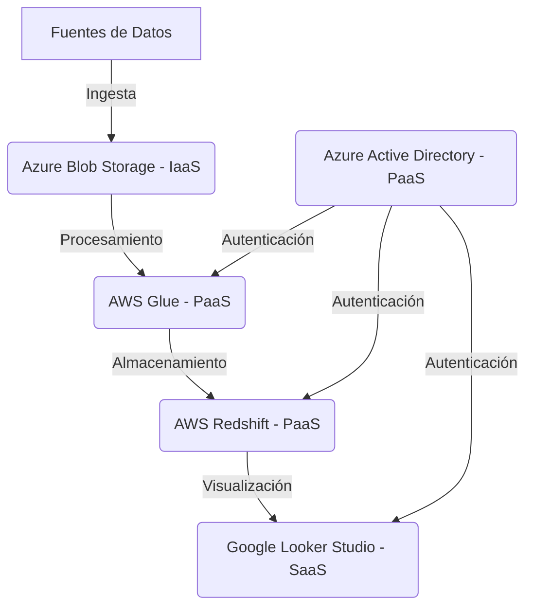

# Comparativa de Modelos de Servicio Cloud: PaaS, IaaS y SaaS

## Introducción
Este documento compara los modelos de servicio cloud **PaaS (Platform as a Service)**, **IaaS (Infrastructure as a Service)** y **SaaS (Software as a Service)**, destacando sus diferencias, ventajas, limitaciones y casos de uso específicos en arquitecturas de datos. La comparación está orientada a ayudar a los equipos de datos a seleccionar el modelo adecuado para cada capa de su arquitectura.

## Definiciones Clave

| **Modelo** | **Definición**                                                                 | **Ejemplos**                                                                 |
|------------|-------------------------------------------------------------------------------|-----------------------------------------------------------------------------|
| **IaaS**   | Proveedor ofrece infraestructura básica (servidores, almacenamiento, redes) como servicio. El usuario gestiona el sistema operativo, aplicaciones y datos. | AWS EC2, Azure Virtual Machines, Google Compute Engine                     |
| **PaaS**   | Proveedor ofrece una plataforma para desarrollar, ejecutar y gestionar aplicaciones sin manejar la infraestructura subyacente. Incluye herramientas de desarrollo, bases de datos y middleware. | AWS Elastic Beanstalk, Google App Engine, Heroku, AWS Glue, Azure Databricks |
| **SaaS**   | Proveedor ofrece aplicaciones completas accesibles a través de internet. El usuario no gestiona infraestructura ni plataforma, solo configura y usa la aplicación. | Google Workspace, Salesforce, Tableau Cloud, Google Looker Studio          |

## Comparación Detallada

### 1. Control y Flexibilidad

| **Criterio**               | **IaaS**                          | **PaaS**                          | **SaaS**                          |
|-----------------------------|-----------------------------------|-----------------------------------|-----------------------------------|
| **Control sobre infraestructura** | Alto (usuario gestiona servidores, redes, almacenamiento) | Medio (usuario gestiona aplicaciones y datos, proveedor gestiona plataforma) | Bajo (usuario solo configura la aplicación) |
| **Flexibilidad**           | Alta (puede instalar cualquier software o sistema operativo) | Media (limitado a herramientas y lenguajes soportados por el PaaS) | Baja (solo personalización dentro de los límites de la aplicación) |
| **Ejemplo en datos**       | Configurar un clúster de Kafka en máquinas virtuales | Usar AWS Glue para procesamiento de datos (sin gestionar clústeres) | Usar Google Looker Studio para visualización (sin gestionar servidores) |

### 2. Costos

| **Criterio**               | **IaaS**                          | **PaaS**                          | **SaaS**                          |
|-----------------------------|-----------------------------------|-----------------------------------|-----------------------------------|
| **Costo inicial**          | Medio (inversión en servidores y configuración) | Bajo (pago por uso o suscripción) | Bajo (suscripción mensual o anual) |
| **Costos operativos**      | Altos (mantenimiento, parches, escalado manual) | Medios (costos por recursos usados) | Bajos (proveedor gestiona todo) |
| **Modelo de precios**      | Pago por recursos reservados (instancias) | Pago por uso (ej: jobs ejecutados, horas de procesamiento) | Pago por usuario o suscripción |
| **Ejemplo en datos**       | Costos fijos por servidores de base de datos | Costos variables por jobs de AWS Glue | Costos fijos por licencia de Looker Studio |

### 3. Escalabilidad

| **Criterio**               | **IaaS**                          | **PaaS**                          | **SaaS**                          |
|-----------------------------|-----------------------------------|-----------------------------------|-----------------------------------|
| **Escalabilidad**          | Manual (requiere configuración de servidores adicionales) | Automática (proveedor escala recursos según demanda) | Automática (proveedor gestiona escalabilidad) |
| **Tiempo de escalado**     | Minutos a horas (depende de la configuración) | Segundos a minutos (automático) | Segundos (automático) |
| **Límites**                | Definidos por el usuario (ej: número de servidores) | Definidos por el proveedor (ej: límites de recursos por job) | Definidos por el proveedor (ej: límites de usuarios) |
| **Ejemplo en datos**       | Escalar manualmente un clúster de Spark en EC2 | AWS Glue escala automáticamente los recursos para un job | Looker Studio maneja automáticamente la carga de usuarios |

### 4. Mantenimiento y Operaciones

| **Criterio**               | **IaaS**                          | **PaaS**                          | **SaaS**                          |
|-----------------------------|-----------------------------------|-----------------------------------|-----------------------------------|
| **Mantenimiento**          | Alto (usuario gestiona parches, actualizaciones, seguridad) | Medio (proveedor gestiona plataforma, usuario gestiona aplicaciones) | Bajo (proveedor gestiona todo) |
| **Tiempo de implementación** | Alto (configuración completa de servidores y redes) | Medio (configuración de aplicaciones y datos) | Bajo (listo para usar) |
| **Ejemplo en datos**       | Mantener servidores de base de datos (ej: actualizar PostgreSQL) | Mantener scripts de procesamiento en AWS Glue | Usar Looker Studio sin preocuparse por mantenimiento |

### 5. Seguridad

| **Criterio**               | **IaaS**                          | **PaaS**                          | **SaaS**                          |
|-----------------------------|-----------------------------------|-----------------------------------|-----------------------------------|
| **Responsabilidad**        | Compartida: proveedor gestiona seguridad física, usuario gestiona seguridad lógica (SO, aplicaciones, datos) | Compartida: proveedor gestiona plataforma, usuario gestiona aplicaciones y datos | Proveedor gestiona todo |
| **Control de acceso**      | Alto (usuario configura firewalls, IAM, redes) | Medio (usuario configura permisos en la plataforma) | Bajo (usuario configura permisos dentro de la aplicación) |
| **Cumplimiento normativo** | Alto (usuario debe asegurar cumplimiento) | Medio (proveedor ofrece herramientas para cumplimiento) | Alto (proveedor asegura cumplimiento) |
| **Ejemplo en datos**       | Configurar VPC y grupos de seguridad en AWS | Configurar políticas de acceso en AWS Glue | Looker Studio cumple con normativas como GDPR |

### 6. Casos de Uso en Arquitecturas de Datos

#### **IaaS: Casos de Uso Ideales**
1. **Almacenamiento de datos crudos:**
   - **Ejemplo:** Azure Blob Storage o AWS S3 para almacenar datos en formato Parquet, Avro o JSON.
   - **Ventajas:** Flexibilidad para elegir formatos y herramientas de procesamiento.
   - **Limitaciones:** Requiere gestión de permisos y políticas de ciclo de vida.

2. **Clústeres personalizados:**
   - **Ejemplo:** Clúster de Apache Kafka en máquinas virtuales para ingestión de datos en tiempo real.
   - **Ventajas:** Control total sobre la configuración y optimización del clúster.
   - **Limitaciones:** Alto mantenimiento y costos operativos.

3. **Bases de datos auto-gestionadas:**
   - **Ejemplo:** PostgreSQL en AWS EC2 para casos que requieren control fino sobre el motor de base de datos.
   - **Ventajas:** Flexibilidad para configurar índices, particiones y extensiones.
   - **Limitaciones:** Responsabilidad total sobre backups, réplicas y parches.

#### **PaaS: Casos de Uso Ideales**
1. **Procesamiento de datos:**
   - **Ejemplo:** AWS Glue o Azure Databricks para transformar datos crudos en datos procesados.
   - **Ventajas:** Eliminación de la gestión de infraestructura, escalabilidad automática.
   - **Limitaciones:** Dependencia de las herramientas y lenguajes soportados por el PaaS.

2. **Bases de datos gestionadas:**
   - **Ejemplo:** AWS Redshift o Google BigQuery para almacenar datos analíticos.
   - **Ventajas:** Optimizado para consultas OLAP, escalabilidad automática.
   - **Limitaciones:** Costos elevados en consultas complejas.

3. **Orquestación de flujos de datos:**
   - **Ejemplo:** AWS Step Functions o Azure Data Factory para coordinar jobs de procesamiento.
   - **Ventajas:** Integración nativa con otros servicios del proveedor.
   - **Limitaciones:** Curva de aprendizaje para configurar flujos complejos.

#### **SaaS: Casos de Uso Ideales**
1. **Visualización y BI:**
   - **Ejemplo:** Google Looker Studio o Tableau Cloud para crear dashboards interactivos.
   - **Ventajas:** Accesibilidad, colaboración y actualización en tiempo real.
   - **Limitaciones:** Personalización limitada a las capacidades de la herramienta.

2. **Colaboración y productividad:**
   - **Ejemplo:** Google Workspace o Microsoft 365 para documentación y comunicación.
   - **Ventajas:** Integración con otras herramientas y acceso desde cualquier dispositivo.
   - **Limitaciones:** Dependencia de la conexión a internet.

3. **Gestión de datos maestros:**
   - **Ejemplo:** Salesforce para gestionar datos de clientes.
   - **Ventajas:** Herramientas integradas para gestión de relaciones y flujos de trabajo.
   - **Limitaciones:** Costos elevados para equipos grandes.

## Ventajas y Limitaciones

### **IaaS**
**Ventajas:**
- **Control total:** Ideal para casos que requieren configuraciones específicas o software no compatible con PaaS/SaaS.
- **Flexibilidad:** Permite instalar cualquier sistema operativo, middleware o aplicación.
- **Costos predecibles:** Para cargas de trabajo estables, puede ser más económico que PaaS.

**Limitaciones:**
- **Alto mantenimiento:** Requiere gestión de servidores, parches, backups y seguridad.
- **Escalabilidad limitada:** El escalado manual puede ser lento y costoso.
- **Curva de aprendizaje:** Requiere conocimientos avanzados de administración de sistemas.

### **PaaS**
**Ventajas:**
- **Productividad:** Permite enfocarse en el desarrollo de aplicaciones sin gestionar infraestructura.
- **Escalabilidad automática:** Los recursos se escalan según la demanda.
- **Integración:** Compatibilidad nativa con otros servicios del proveedor (ej: AWS Glue con S3 y Redshift).

**Limitaciones:**
- **Dependencia del proveedor:** La lógica de la aplicación puede estar ligada a APIs específicas del PaaS.
- **Limitaciones de personalización:** No todos los lenguajes o herramientas están soportados.
- **Costos variables:** Jobs mal optimizados pueden generar gastos elevados.

### **SaaS**
**Ventajas:**
- **Accesibilidad:** Acceso desde cualquier dispositivo con conexión a internet.
- **Colaboración:** Herramientas diseñadas para trabajo en equipo.
- **Sin mantenimiento:** El proveedor gestiona infraestructura, plataforma y aplicaciones.

**Limitaciones:**
- **Personalización limitada:** Solo se puede configurar dentro de los límites de la aplicación.
- **Dependencia de internet:** Requiere conexión estable para funcionar.
- **Costos recurrentes:** Suscripciones mensuales/anuales pueden ser costosas para equipos grandes.

## Conclusiones

| **Criterio**               | **Recomendación**                                                                 |
|-----------------------------|-----------------------------------------------------------------------------------|
| **Almacenamiento**         | **IaaS** (flexibilidad y costo-efectividad para datos crudos).                    |
| **Procesamiento**          | **PaaS** (equilibrio entre control y productividad).                              |
| **Bases de datos**         | **PaaS** (escalabilidad y rendimiento para consultas analíticas).                |
| **Visualización y BI**     | **SaaS** (accesibilidad y colaboración para equipos de negocio).                  |
| **Seguridad y gobernanza** | **PaaS** (herramientas integradas para gestión de identidades y cumplimiento).   |

**Decisiones clave para arquitecturas de datos:**
1. **Usar IaaS para almacenamiento** cuando se requiere flexibilidad en formatos y herramientas.
2. **Usar PaaS para procesamiento y bases de datos** para evitar la gestión de infraestructura.
3. **Usar SaaS para herramientas de BI** para priorizar accesibilidad y colaboración.
4. **Combinar modelos** según las necesidades de cada capa de la arquitectura.

## Ejemplo Práctico: Arquitectura de Datos Híbrida

**Flujo explicado:**
1. **Ingesta:** Datos crudos se almacenan en Azure Blob Storage (IaaS).
2. **Procesamiento:** AWS Glue (PaaS) transforma y limpia los datos.
3. **Almacenamiento:** Los datos procesados se almacenan en AWS Redshift (PaaS).
4. **Visualización:** Google Looker Studio (SaaS) consume los datos de Redshift para crear dashboards.
5. **Seguridad:** Azure Active Directory (PaaS) gestiona autenticación y permisos.

## Recomendaciones Finales
1. **Evaluar requisitos específicos:** Cada capa de la arquitectura puede requerir un modelo diferente.
2. **Monitorear costos:** Usar herramientas como AWS Cost Explorer o Azure Cost Management para evitar sorpresas.
3. **Priorizar gobernanza:** Implementar catálogos de datos y políticas de acceso para evitar silos.
4. **Optimizar rendimiento:** Usar formatos columnares (Parquet) y particionar datos para reducir costos y mejorar velocidad.
5. **Capacitar equipos:** Asegurar que los equipos entiendan las ventajas y limitaciones de cada modelo.

## Referencias
- [NIST Definition of Cloud Computing](https://nvlpubs.nist.gov/nistpubs/Legacy/SP/nistspecialpublication800-145.pdf)
- [AWS: Choose the Right Cloud Service Model](https://aws.amazon.com/types-of-cloud-computing/)
- [Microsoft Azure: IaaS vs PaaS vs SaaS](https://azure.microsoft.com/en-us/overview/what-is-iaas/)
- [Google Cloud: Cloud Computing Services](https://cloud.google.com/learn/paas-vs-iaas-vs-saas)